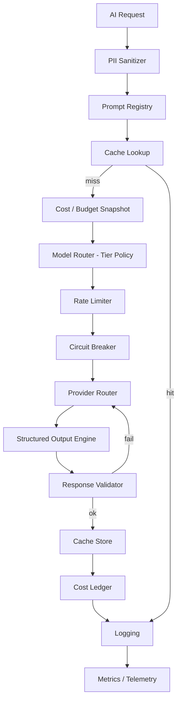
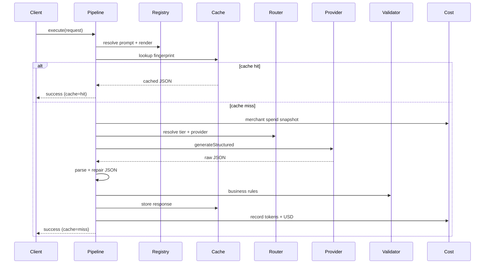

# AI Platform Foundation

StorePilot Sprint 1 delivers reusable AI infrastructure under `app/ai/foundation/`. Merchant and agent code never calls providers or models directly — all requests flow through one pipeline.

## Architecture



## Request sequence



## Folder structure

```
app/ai/foundation/
  provider-router/     OpenAI + Anthropic adapters, future stubs
  model-router/        Tier config + budget downgrade policy
  prompt-registry/     Versioned prompts (in-memory + file-backed)
  structured-output/   JSON parse, repair, schema validation
  response-validator/  Confidence, enums, unknown fields
  cache/               Semantic fingerprint cache + webhook invalidation
  cost/                Token/cost ledger (in-memory + Prisma)
  retry/               Exponential backoff + circuit breaker
  rate-limit/          Token bucket limiter
  logging/             Structured request logs
  metrics/             Aggregated dashboard metrics
  telemetry/           Optional persistence hook
  observability/       Health report aggregation
  queue/               In-memory request queue stub
  types/               Shared foundation types
  utils/               Hash, PII sanitizer, JSON helpers
  pipeline.ts          Orchestrates full request flow
  client.ts            Public AIFoundationClient entry point
```

## Usage

```typescript
import { z } from "zod";
import { createAIFoundationClient } from "~/ai/foundation";

const schema = z.object({
  label: z.string(),
  confidence: z.number().min(0).max(1),
});

const client = createAIFoundationClient();

const response = await client.execute({
  promptId: "foundation.example",
  messages: [{ role: "user", content: "Classify this signal." }],
  context: {
    storeId: "...",
    feature: "example",
    taskCategory: "classification", // routes to nano tier
  },
  output: { schema, schemaName: "example.output" },
});

if (response.ok) {
  console.log(response.data, response.modelTier, response.estimatedCostUsd);
}
```

## Security

- PII fields (email, phone, address, payment) are stripped or redacted before any provider call.
- Only aggregated operational facts leave StorePilot infrastructure.
- Prompts and variables are hashed for cache keys — raw PII is never cached intentionally.

## Database

Migration `20260709160000_ai_platform_foundation` adds:

- `ai_cost_ledger` — per-request token and cost records
- `ai_merchant_budgets` — monthly USD budget per store

Use `PrismaCostLedgerStore` in production; tests use `InMemoryCostLedger`.

## Cost estimate (typical merchant)

| Tier       | Task example        | Tokens (avg) | Est. cost/request |
|------------|---------------------|--------------|-------------------|
| Reasoning  | Strategic planning  | 3,000        | ~$0.05–0.15       |
| Standard   | Executive summary   | 2,000        | ~$0.01–0.04       |
| Fast       | Daily report        | 1,200        | ~$0.001–0.003     |
| Nano       | Classification      | 400          | ~$0.0001–0.0005   |

Budget downgrade at 70% / 85% / 95% monthly spend reduces tier automatically without merchant-visible errors.

## Performance estimate

| Path              | Latency (p50) | Notes                          |
|-------------------|---------------|--------------------------------|
| Cache hit         | < 5 ms        | In-memory fingerprint lookup   |
| Nano tier (live)  | 300–800 ms    | Provider-dependent             |
| Reasoning tier    | 2–8 s         | Larger context + model         |
| With retry        | +500 ms–15 s  | Exponential backoff cap 15 s   |

## Known limitations

1. **Cache** — in-memory only; not shared across Vercel instances. Sprint 2 should add Redis/Upstash.
2. **Queue** — stub only; no distributed job enqueue yet.
3. **Semantic cache** — fingerprint-based (prompt hash + variables), not embedding similarity yet.
4. **Gemini / Grok / Local** — interface stubs; throw configuration errors until configured.
5. **Orchestrator integration** — foundation is parallel to existing `ai-orchestrator.server.ts`; Sprint 2 wires agents to foundation client.
6. **Actual provider billing** — ledger stores estimated USD from tier rates; reconcile against provider invoices separately.

## Ready for Sprint 2 checklist

- [x] Tier-based model routing (Reasoning / Standard / Fast / Nano)
- [x] Provider abstraction (OpenAI + Anthropic)
- [x] Versioned prompt registry
- [x] Structured JSON-only output path
- [x] Response validation + auto-retry
- [x] Cost ledger + budget downgrade
- [x] Cache with webhook invalidation hooks
- [x] Retry, circuit breaker, rate limit
- [x] Logging, metrics, telemetry hooks
- [x] PII sanitization
- [x] Unit tests with provider mocks
- [x] Prisma migration for cost persistence
- [ ] Wire Executive COO / agents to `AIFoundationClient`
- [ ] Distributed cache (Redis)
- [ ] Embedding-based semantic cache
- [ ] Production health route (`/health/ai-foundation`)

## Related docs

- [MODEL_ROUTING.md](./MODEL_ROUTING.md)
- [PROMPT_REGISTRY.md](./PROMPT_REGISTRY.md)
- [STRUCTURED_OUTPUT.md](./STRUCTURED_OUTPUT.md)
- [AI_COST_CONTROL.md](./AI_COST_CONTROL.md)
