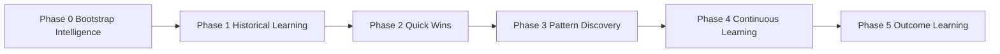
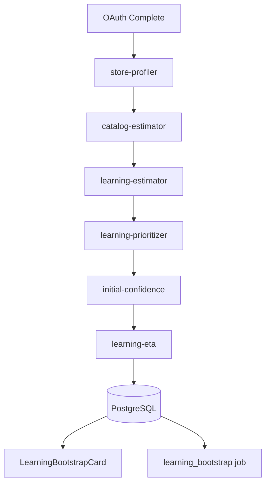

# Bootstrap Architecture

## Position in Learning Phases



Sprint 4A implements **Phase 0** only.

## Internal Components



## Folder Layout

```
app/learning/
  bootstrap/
    store-profiler/     # Shopify GraphQL metadata
    catalog-estimator/  # Size tier + complexity
    learning-estimator/ # Duration + cost estimate
    learning-prioritizer/
    bootstrap-orchestrator.ts
    bootstrap-intelligence.ts  # persistence
  readiness/
  velocity/             # via initial-confidence assignments
  eta/
  scheduler/
  api/
  shared/
```

## Worker Integration

| Job | Priority | When |
|-----|----------|------|
| `learning_bootstrap` | critical | Re-profile on reinstall (optional) |

Primary path: synchronous in `afterAuth` before `advanceOnboarding`.

## Performance Targets

| Store Size | Profiling Time | Typical ETA |
|------------|----------------|-------------|
| Tiny (<50 products) | <10s | 15–25 min |
| Small | <20s | 25–45 min |
| Medium | <30s | 45–90 min |
| Large | <45s | 90–180 min |

Estimates scale with `PRODUCTS_PER_MINUTE` and `ORDERS_PER_MINUTE` constants.

## Privacy

No customer, email, phone, address, or payment data. Count queries and aggregate timestamps only.
