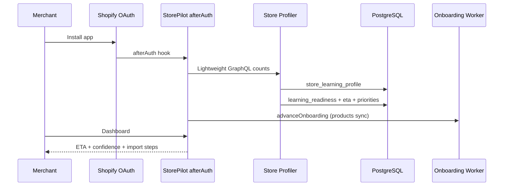

# Bootstrap Intelligence

Sprint 4A delivers lightweight store profiling immediately after OAuth — before any catalog download.

## Flow

## What Gets Collected (Metadata Only)

- Product, variant, collection, order counts
- Location and vendor estimates (sample-based)
- Tag cardinality (first 250 tags)
- Oldest/newest order timestamps
- Store age and estimated history months

**Never:** full catalog download, customer PII, GPT calls.

## Outputs

| Table | Purpose |
|-------|---------|
| `store_learning_profile` | Size tier, complexity scores, worker estimate |
| `learning_readiness` | Stage, domain confidences, merchant copy |
| `learning_eta` | Duration breakdown + completion timestamp |
| `learning_velocity` | Fast/medium/slow per intelligence domain |
| `learning_priorities` | Trial-optimized learning order |

## Module Entry Points

- `runBootstrapIntelligence({ storeId, admin })` — synchronous after OAuth
- `executeLearningBootstrapJob` — worker re-run path
- `getBootstrapStatus(storeId)` — API status

## Critical Rules

1. Metadata queries only — no product bodies
2. Deterministic — same inputs → same confidence/ETA
3. Complete in minutes, not hours
4. Seeds Historical Intelligence Engine (Sprint 4B)
