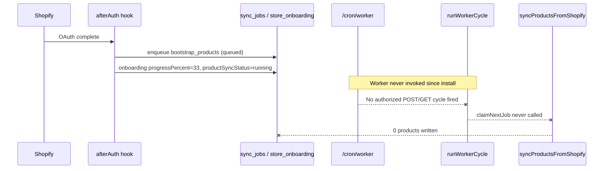

# Bootstrap Sync Audit — Production Investigation

**Date:** 2026-07-09  
**Mode:** Read-only — no code or database modifications  
**Production URL:** `https://store-pilot-eta.vercel.app`  
**Dev store:** `storepilot-pe9x0muw.myshopify.com`  
**Store ID:** `7f1a9df7-d3db-45a1-9a59-a12155f371a1`

---

## Executive summary

| Question | Answer |
|----------|--------|
| **Exact root cause** | Bootstrap job was enqueued during OAuth but **never processed** — no worker cycle has run since install. |
| **Data actually synced?** | **No** — 0 products, 0 orders in production DB. |
| **UI incorrect / stale?** | **No** — dashboard reads live `store_onboarding` rows. UI is **misleading** because progress is set at enqueue time, not when sync starts. |
| **Worker offline?** | **Yes (de facto)** — no persistent worker process; HTTP cron worker has not executed. |
| **Stack trace** | **None** — worker never claimed the job; Shopify API never called. |
| **Risk level** | **High** — onboarding blocked for every new install until worker runs; **Low** to remediate via manual cron trigger. |

---

## Root cause (exact)

**The `bootstrap_products` job created in `afterAuth` remains in `queued` status with `attempts: 0` because the background worker engine (`runWorkerCycle`) has never been invoked in production since the install at `2026-07-09T12:19:02Z`.**

OAuth and job enqueue succeeded. The failure is entirely in **job execution infrastructure**, not OAuth, Shopify pagination, or product sync logic.

### Causal chain



---

## Production evidence

### `sync_jobs` (queried 2026-07-09 ~13:50 UTC)

| Field | Value |
|-------|-------|
| Job ID | `f3260095-2747-45a8-b4b8-4745b0ddab21` |
| `jobType` | `bootstrap_products` |
| **Status** | **`queued`** |
| `attempts` | **0** (never claimed) |
| `maxAttempts` | 5 |
| `priority` | `critical` |
| `idempotencyKey` | `onboarding:7f1a9df7-d3db-45a1-9a59-a12155f371a1:products` |
| `lockedBy` / `lockedAt` / `startedAt` | all **null** |
| `createdAt` | `2026-07-09T12:19:02.433Z` |
| Job events | 1 × `progress` — `"Job created"` only |

### `store_onboarding`

| Field | Value |
|-------|-------|
| Status | `running` |
| `progressPercent` | **33** |
| `progressLabel` | **"Syncing products"** |
| `productSyncStatus` | **`running`** |
| `inventorySyncStatus` | `not_started` |
| `ordersSyncStatus` | `not_started` |
| `currentJobId` | `f3260095-2747-45a8-b4b8-4745b0ddab21` |
| Linked job DB status | **`queued`** (mismatch: onboarding says running, job is queued) |
| `lastErrorCode` / `lastErrorMessage` | null |
| `completedAt` | null |

### Data counts

| Table | Count |
|-------|-------|
| `products` | **0** |
| `orders` | **0** |
| `webhook_events` | **0** (expected until Shopify delivers events) |

### Production logs (Vercel)

| Log pattern | Found? |
|-------------|--------|
| `[after-auth] onboarding_advanced` → `enqueued`, phase `PRODUCTS` | **Yes** (install ~12:18–12:19 UTC) |
| `[cron-worker] cron_worker_started` | **No** |
| `[worker] Worker cycle started` | **No** |
| `[job] Job claimed` | **No** |
| `[product-sync] Product sync started` | **No** |
| Bootstrap / sync failure stack traces | **None** |

**Conclusion:** OAuth pipeline completed; worker pipeline never started.

---

## Investigation details

### 1. Bootstrap job created during OAuth — verified

**File:** `app/shopify.server.ts`  
**Function:** `afterAuth` hook  
**Lines:** 143–162

```typescript
await getOrCreateStoreOnboarding(store.id);
// ...
const advanceResult = await advanceOnboarding({ storeId: store.id });
```

**File:** `app/services/onboarding.server.ts`  
**Functions:** `advanceOnboarding` (749), `executeAdvanceOnboarding` (633), `enqueueAndLinkPhaseJob` (578)

On first install, `executeAdvanceOnboarding` selects phase `PRODUCTS` and calls `enqueueAndLinkPhaseJob`, which:

1. Creates `sync_jobs` row via `enqueueJobWithClient` — `app/services/job.server.ts:312–360`
2. Updates `store_onboarding` with progress and phase status — `onboarding.server.ts:598–608`

**Job type config:** `PHASE_CONFIG.PRODUCTS` — `onboarding.server.ts:113–121`

```typescript
progressPercent: 33,
progressLabel: "Syncing products",
jobType: JobType.bootstrap_products,
```

Production logs confirm: `onboarding_advanced` with `action: enqueued`, `jobId: f3260095-2747-45a8-b4b8-4745b0ddab21`.

Re-auth returns `action: noop` when phase is already `running` with a linked job — `onboarding.server.ts:699–707`.

---

### 2. Job status — queued, not running/failed/completed

| Expected state if worker ran | Actual |
|------------------------------|--------|
| `running` → `completed` | Stuck at **`queued`** |
| `attempts >= 1` | **`attempts: 0`** |
| `lockedBy` set during claim | **null** |
| Product rows in DB | **0** |

**Claim logic (never reached):** `claimNextJob` — `app/services/job.server.ts:494–568`  
Uses `FOR UPDATE SKIP LOCKED` on `sync_jobs` where `status = 'queued'`.

---

### 3. Job workers — architecture

| Technology | Present? |
|------------|----------|
| BullMQ | **No** |
| Railway workers | **No** |
| Persistent Node worker process | **No** |
| Postgres `sync_jobs` queue | **Yes** |
| HTTP cron worker | **Yes** — `/cron/worker` |

**Worker entry point**

| File | Function | Lines |
|------|----------|-------|
| `app/routes/cron.worker.tsx` | `loader` / `action` | 84–185 |
| `app/services/worker.server.ts` | `runWorkerCycle` | 780–784 |
| `app/services/worker.server.ts` | `runWorkerBatch` | 786–809 |
| `app/services/worker.server.ts` | `executeKnownJob` → `bootstrap_products` | 522–572 |

`bootstrap_products` calls `syncProductsFromShopify` — `worker.server.ts:532–537` → `product.server.ts:845+`.

**Batch size:** 1 job per worker cycle (`runWorkerBatch(workerId, 1)`).

---

### 4. Is any background worker currently processing jobs?

**No.**

Evidence:

- Zero worker log lines in production since install
- Job `attempts: 0`, never locked
- No `[worker]` / `[cron-worker]` / `job_claimed` log entries

The worker only runs when `/cron/worker` is invoked with valid cron auth and executes `runWorkerCycle()`.

---

### 5. Cron / scheduler configuration — mismatch

**Deployed schedule** — `vercel.json:5–10`:

```json
{ "path": "/cron/worker", "schedule": "0 1 * * *" }
```

Runs **once daily at 01:00 UTC**.

**Documented / code-intended schedule** — `app/services/cron-scheduler.server.ts:140–147`:

```typescript
export const WORKER_CRON_SCHEDULE = {
  schedule: "*/2 * * * *",  // every 2 minutes
  path: "/cron/worker",
};
```

**Docs:** `docs/F42_WORKER_CRON_DEPLOYMENT.md` recommends `*/2 * * * *` and external POST scheduler with `x-cron-secret`.

**Timeline impact:** Install at `12:19 UTC` → next Vercel cron at `01:00 UTC` next day (~12+ hours). User sees indefinite "syncing" during that window.

**Other crons in `vercel.json`:** dispatch routes at 02:00–06:00 UTC daily — unrelated to bootstrap queue processing.

---

### 6. Cron authentication behavior

**File:** `app/services/cron-auth.server.ts`  
**Function:** `isAuthorizedCronRequest` — lines 18–38

Accepts:

- Header `x-cron-secret` matching `CRON_SECRET`
- Header `Authorization: Bearer <CRON_SECRET>`

**File:** `app/routes/cron.worker.tsx`

| Request | Auth | Behavior |
|---------|------|----------|
| GET + authorized | Bearer or `x-cron-secret` | Runs `runWorkerCycle` — lines 91–128 |
| GET + **unauthorized** | None | Returns health JSON only — **does not process jobs** — lines 131–136 |
| POST + authorized | Secret header | Runs `runWorkerCycle` — lines 139–170 |
| POST + unauthorized | None | 401 — lines 145–147 |

Vercel Cron can send `Authorization: Bearer $CRON_SECRET` when `CRON_SECRET` is set in project env. **Even with valid auth, the daily schedule prevents timely processing after install.**

If `CRON_SECRET` is missing, `getCronWorkerHealth()` reports `queueEnabled: false` — `app/services/cron-worker.server.ts:9–26`.

---

### 7. Shopify API pagination — not reached

**File:** `app/services/product.server.ts`

| Function | Lines | Purpose |
|----------|-------|---------|
| `syncProductsFromShopify` | 845–1049+ | Main sync loop |
| `fetchProductPage` | 624–647 | GraphQL product page |
| Pagination | 877–881, 1046–1047 | `hasNextPage` / `endCursor` cursor loop |
| Variant pagination | 730–756 | Per-product variant pages |

GraphQL query uses `pageInfo { hasNextPage endCursor }` — lines 45–53, 109–110.

**Not a factor in this incident** — worker never called `syncProductsFromShopify`; no Shopify API requests logged.

---

### 8. Rate-limit handling — not reached

**File:** `app/services/shopify-graphql-retry.server.ts`  
**Function:** `shopifyGraphqlWithRetry` — lines 18–44

**File:** `app/lib/http-retry.server.ts`  
**Line 13:** `429` in `RETRYABLE_HTTP_STATUS`

Retries: 500ms, 1500ms, 3000ms backoff via `executeWithRetry`.

**Not exercised** — no GraphQL calls occurred.

---

### 9. Retry logic — not exercised

**Onboarding max attempts:** `ONBOARDING_JOB_MAX_ATTEMPTS = 5` — `onboarding.server.ts:17`

**Job failure / retry:** `failJobWithClient` — `job.server.ts:834–914`

- Requeues with exponential backoff if `attempts < maxAttempts`
- Dead-letter + `markPhaseFailedWithClient` only after max attempts — `onboarding.server.ts:950–977`

**Worker failure handler:** `handleJobFailure` — `worker.server.ts:226–251`

**Current job:** `attempts: 0` — retry path never entered.

---

### 10. Onboarding progress after sync completion — code path exists but never ran

On successful sync, worker calls `finalizeSuccessfulOnboardingJob` → `finalizeSuccessfulJobPhase`:

| File | Function | Lines |
|------|----------|-------|
| `app/services/worker.server.ts` | `finalizeSuccessfulOnboardingJob` | 326–365 |
| `app/services/onboarding.server.ts` | `finalizeSuccessfulJobPhase` | 394–444 |
| `app/services/onboarding.server.ts` | `markPhaseCompletedWithClient` | 352–370 |
| `app/services/onboarding.server.ts` | `executeAdvanceOnboarding` (next phase) | 633–724 |

After PRODUCTS completes, progress advances to 66% (inventory) via next enqueue. After all phases, `progressPercent: 100` — lines 669–677.

**None of this ran** because the job never left `queued`.

---

### 11. Dashboard onboarding state — not stale

**Loader:** `app/routes/app._index.tsx:84–96`  
Calls `getOnboardingStatus(store.id)` → reads `store_onboarding` from DB.

**UI:** `app/components/OnboardingCard.tsx:28–31, 44–46, 56`

Displays `onboarding.progressPercent` and `onboarding.progressLabel` directly from loader data.

**UX issue (not a bug):** `enqueueAndLinkPhaseJob` sets `productSyncStatus: running` and `progressPercent: 33` **at enqueue time** (`onboarding.server.ts:605–607`), before the worker claims the job. The UI truthfully shows DB state but **implies active sync while the job is still queued**.

---

## Summary matrix

| Check | Result |
|-------|--------|
| Bootstrap job created during OAuth | ✅ Pass |
| Job queued | ✅ Yes — stuck |
| Job running | ❌ Never started |
| Job failed | ❌ No |
| Job completed | ❌ No |
| Worker processing | ❌ No cycles logged |
| BullMQ / Railway | ❌ Not used |
| Shopify pagination | ⏸ Not reached |
| Rate limits | ⏸ Not reached |
| Retry logic | ⏸ Not reached |
| Progress update on completion | ⏸ Not reached |
| Dashboard stale cache | ❌ Reads live DB |
| Products in DB | ❌ 0 |

---

## Exact fix (recommendations only — not implemented)

### Immediate (ops — unblocks current store)

Manually trigger one worker cycle:

```bash
curl -X POST "https://store-pilot-eta.vercel.app/cron/worker" \
  -H "x-cron-secret: $CRON_SECRET" \
  -H "Content-Type: application/json"
```

Expected: `processed.jobType: bootstrap_products`, `status: completed`. Then repeat until onboarding reaches 100% (products → inventory → orders — 3 cycles minimum).

Verify in DB: job `status: completed`, `products` count > 0, `progressPercent` advances.

### Short-term (deployment config)

1. **Fix worker schedule** in `vercel.json`: change `/cron/worker` from `0 1 * * *` to `*/2 * * * *` (match `WORKER_CRON_SCHEDULE`).
2. **Confirm `CRON_SECRET`** is set in Vercel production env (required for `queueEnabled: true`).
3. **Verify Vercel Cron auth:** ensure cron invocations include Bearer token (Vercel auto-injects when `CRON_SECRET` is set) OR deploy external scheduler per `docs/F42_WORKER_CRON_DEPLOYMENT.md` with POST + `x-cron-secret` every 2 minutes.

### Medium-term (product / UX)

1. **Distinguish queued vs syncing:** set `productSyncStatus: running` only when `claimNextJob` succeeds, or show "Waiting for worker" when job is `queued`.
2. **Post-install health check:** alert if `sync_jobs` remain `queued` > N minutes after `afterAuth`.
3. **Optional:** trigger one worker cycle from `afterAuth` (fire-and-forget POST) for faster first sync — evaluate serverless timeout limits.

### Files to change (when implementing)

| File | Change |
|------|--------|
| `vercel.json` | Worker cron schedule `*/2 * * * *` |
| Vercel env | Ensure `CRON_SECRET` |
| `app/services/onboarding.server.ts` | Optional: defer `running` status until claim |
| External scheduler / GitHub Action | POST `/cron/worker` every 2 min |

---

## Risk assessment

| Area | Level | Notes |
|------|-------|-------|
| **User impact** | **High** | Every new install appears stuck at 33% until worker runs |
| **Data integrity** | **Low** | No partial/corrupt sync; job is safely queued |
| **Fix complexity** | **Low** | Config + manual curl; no schema migration |
| **Fix regression risk** | **Low** | Enabling cron does not alter enqueue logic |
| **If left unfixed** | **High** | Onboarding never completes without manual intervention |

---

## Appendix — key file reference

| Concern | File | Function / symbol | Lines |
|---------|------|-------------------|-------|
| OAuth bootstrap | `app/shopify.server.ts` | `afterAuth` | 80–175 |
| Job enqueue | `app/services/onboarding.server.ts` | `enqueueAndLinkPhaseJob` | 578–631 |
| 33% progress constant | `app/services/onboarding.server.ts` | `PHASE_CONFIG.PRODUCTS` | 113–121 |
| Job claim | `app/services/job.server.ts` | `claimNextJob` | 494–568 |
| Worker cycle | `app/services/worker.server.ts` | `runWorkerCycle` | 780–784 |
| Product sync | `app/services/product.server.ts` | `syncProductsFromShopify` | 845+ |
| Cron route | `app/routes/cron.worker.tsx` | `loader` / `action` | 84–185 |
| Cron auth | `app/services/cron-auth.server.ts` | `isAuthorizedCronRequest` | 18–38 |
| Deployed cron | `vercel.json` | `crons[0]` | 5–6 |
| Intended schedule | `app/services/cron-scheduler.server.ts` | `WORKER_CRON_SCHEDULE` | 140–147 |
| Dashboard UI | `app/components/OnboardingCard.tsx` | `OnboardingCard` | 11–113 |
| Loader | `app/routes/app._index.tsx` | `loader` | 84–96 |

---

*Investigation performed read-only against production Supabase and Vercel logs. No code or database changes were made.*
