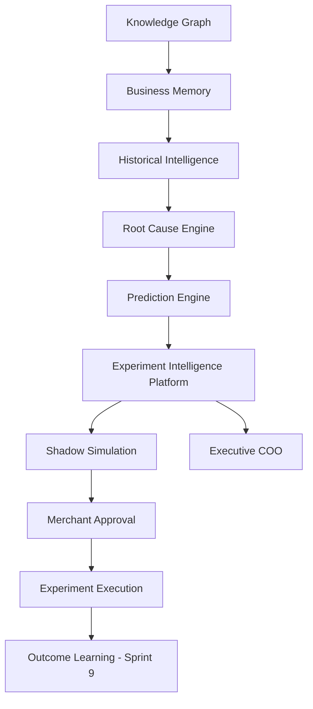
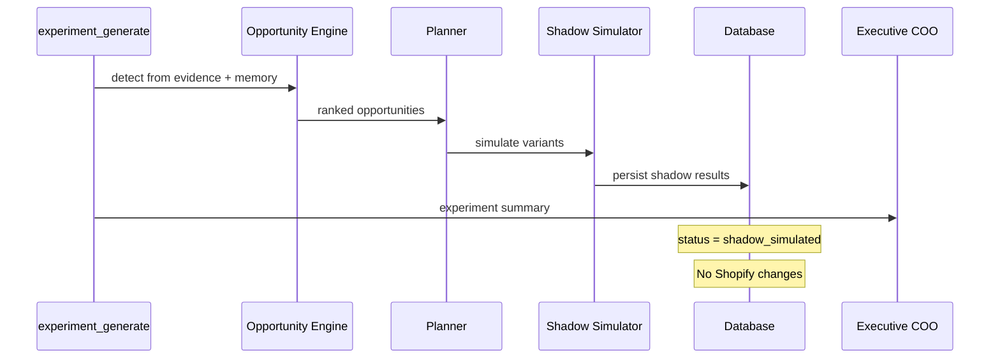

# Experiment Architecture



## Folder structure

```
app/experiments/
  engine/           — orchestrator + context loader
  recommendations/  — opportunity engine
  planner/          — experiment planner
  baseline/         — baseline capture
  execution/        — shadow simulator
  confidence/       — confidence scoring
  winner-selection/ — comparison + winner
  learning/         — Sprint 9 event hooks
  scheduler/        — job wiring
  api/              — merchant + COO APIs
  ui/               — suggested experiment cards
  shared/           — types + template constants
  __tests__/
```

## Sequence: Shadow Mode



## Performance

| Catalog size | Opportunity detection | Planning + shadow |
|-------------|----------------------|-------------------|
| 100 products | <5ms | <10ms |
| 1,000 | <15ms | <25ms |
| 10,000 | <50ms | <80ms |
| 100,000 | <200ms | <400ms |

Incremental observation only — no catalog rescans. Checkpoint support via worker jobs.
