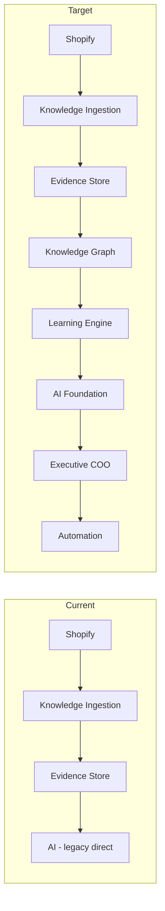
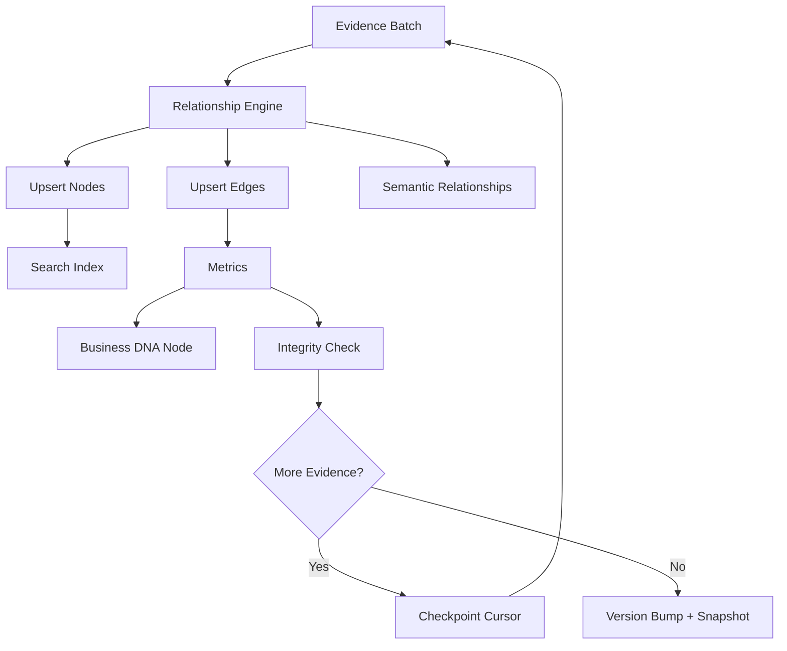
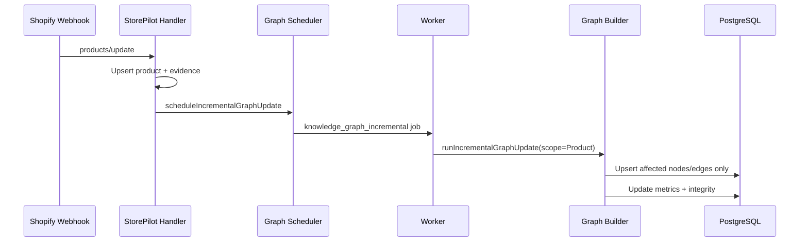
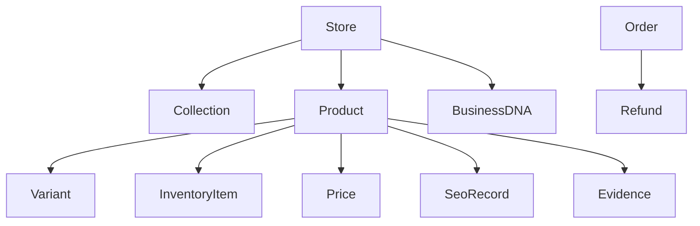

# Graph Architecture

## System Position

The Knowledge Graph sits between evidence ingestion and all intelligence capabilities.

Sprint 3 implements **G** only. Downstream boxes expose interfaces, not implementations.

## Builder Pipeline

## Incremental Update Pipeline

## Node Hierarchy

## Technology Choices

| Decision | Rationale |
|----------|-----------|
| PostgreSQL tables | Matches existing stack; domain graph is bounded |
| Normalized schema | Referential integrity, auditability |
| Application-layer BFS | Sufficient for V1 traversal depths |
| Checkpoint batching | Memory-efficient builds at 100k+ products |
| Evidence binding on edges | Explainability for future AI |

## Performance Strategy

- Batch size: 100 evidence rows per builder pass
- Checkpoint resume via `KnowledgeGraphBuildCheckpoint.evidenceCursor`
- Scoped incremental rebuild by `entityType + entityId`
- Neighborhood cache for repeated query patterns

## Security Boundary

Nodes are **never** created for: Customer, Email, Phone, Address, Payment, or customer behavior. Only operational business intelligence.
