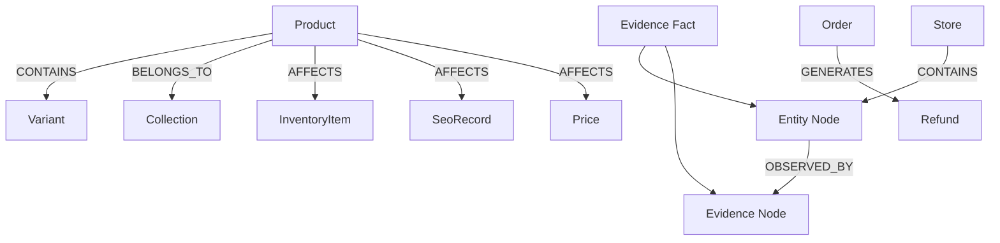

# Graph Relationships

The Relationship Engine (`app/knowledge/graph/relationships/relationship-engine.ts`) automatically connects entities from evidence facts.

## Relationship Flow

## Automatic Rules

| Fact Pattern | Relationship | Target Node |
|--------------|--------------|-------------|
| Any evidence | OBSERVED_BY | Evidence node |
| Any entity | CONTAINS (from Store) | Store node |
| Variant entity | CONTAINS (from Product) | Product node |
| InventoryLow, OutOfStock, etc. | AFFECTS | InventoryItem |
| MissingSEO, MissingMetaDescription | AFFECTS | SeoRecord |
| PriceChanged, MarginRiskCandidate | AFFECTS | Price |
| SingleProductCollection | BELONGS_TO | Collection |
| RefundRiskSeed on Order | GENERATES | Refund |

## Evidence Binding

Every edge stores:

| Field | Purpose |
|-------|---------|
| `evidenceId` | Source evidence row |
| `evidenceVersion` | Version at bind time |
| `evidenceSource` | Connector (e.g. shopify) |
| `confidence` | Fact confidence |
| `observationCount` | How many times observed |
| `freshnessMinutes` | Age of observation |

Semantic relationships in `knowledge_graph_relationships` duplicate provenance for explainability queries.

## Inactive Evidence

When `evidence.active = false`, the engine deactivates edges touching the evidence node.

## Future Relationships

Reserved edge types for Sprint 4+:

- `DEPENDS_ON` — supply chain dependencies
- `CAUSES` — causal chains for root cause engine
- `PREDICTS` — prediction engine outputs
- `RESULTED_IN` — experiment outcomes
- `LEARNS_FROM` — learning engine feedback loops
