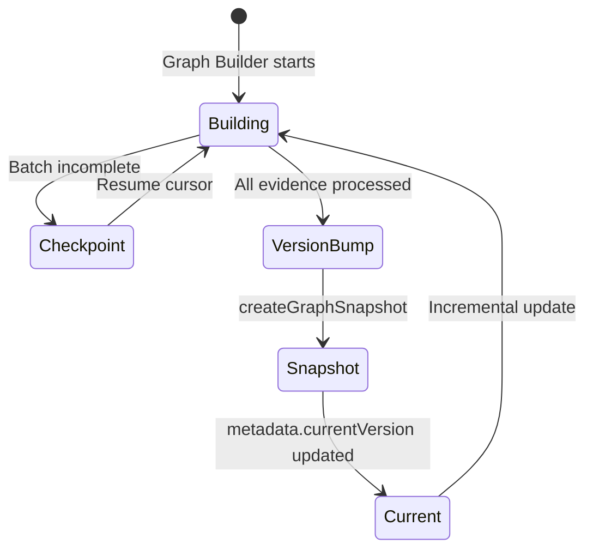

# Graph Versioning

Immutable graph snapshots enable diff, rollback comparison, and historical analysis.

## Snapshot Lifecycle



## Version Model

Each store maintains:

- `KnowledgeGraphMetadata.currentVersion` — active version number
- `KnowledgeGraphVersion` rows — version metadata (label, node/edge counts)
- `KnowledgeGraphSnapshot` rows — immutable JSON captures

## Operations

| Function | Purpose |
|----------|---------|
| `bumpGraphVersion` | Increment version after build |
| `createGraphSnapshot` | Capture nodes, edges, metrics with SHA-256 hash |
| `diffGraphSnapshots` | Compare two versions (nodes/edges added/removed) |
| `getCurrentGraphVersion` | Read active version |

## Snapshot Contents

```json
{
  "nodeSnapshot": [...],
  "edgeSnapshot": [...],
  "metricsSnapshot": {
    "totalNodes": 1200,
    "totalEdges": 3400,
    "evidenceCoverage": 0.95
  },
  "snapshotHash": "sha256..."
}
```

## Use Cases

- "What changed in the last 30 days?" — diff version N vs current
- Rollback comparison — inspect snapshot before applying repair
- Audit trail — every full/incremental build completion creates a version

## History Module

`app/knowledge/graph/history/` re-exports diff utilities. Fine-grained mutation logs are deferred to Sprint 4.
