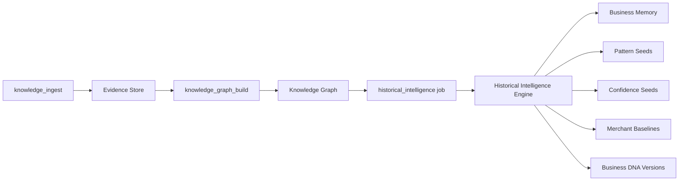

# Historical Intelligence Engine

Packages Knowledge Ingestion + Knowledge Graph into one deterministic learning pipeline that produces **Business Memory**.

## Pipeline



## Trigger

After `knowledge_graph_build` completes with no remaining work, the worker schedules:

```typescript
scheduleHistoricalIntelligenceJob({
  storeId,
  graphVersion: graphResult.snapshotVersion,
  idempotencyKey: `historical:after-graph:${storeId}`,
});
```

## Module Layout

```
app/learning/historical/
  historical-intelligence/   # Main orchestrator
  aggregation/               # DB + evidence aggregation
  history-import/            # Merchant baseline builder
  pattern-seeds/             # Deterministic pattern detection
  confidence-seeds/          # Domain confidence synthesis
  dna-builder/               # Versioned Business DNA
  memory-seeds/              # Persistence + snapshots
  scheduler/                 # Worker job scheduling
  api/                       # Read APIs
  shared/                    # Types
```

## Inputs

| Source | Data |
|--------|------|
| Evidence Store | Fact counts by type |
| Knowledge Graph | Node/edge stats, BusinessDNA node |
| Products / Orders | Revenue, pricing, inventory baselines |
| Learning Readiness | Bootstrap confidence seeds |

## Outputs

| Artifact | Table |
|----------|-------|
| Business Memory | `historical_memory` |
| Historical Snapshot | `historical_snapshots` |
| Pattern Seeds | `pattern_seeds` |
| Confidence Seeds | `confidence_seeds` |
| Merchant Baselines | `merchant_baselines` |
| Business DNA Version | `business_dna_versions` |

## Rules

- **No GPT** — pure SQL aggregation + deterministic rules
- **No Quick Wins** — deferred to Sprint 4C
- **No recommendations**
- **Evidence-bound** — pattern seeds reference fact types observed in evidence
- Advances `learning_readiness.stage` to **`learning`**

## API

```typescript
import {
  runHistoricalIntelligenceEngine,
  getHistoricalMemory,
  getPatternSeeds,
  getMerchantBaselines,
  getLatestBusinessDna,
} from "~/learning";
```
