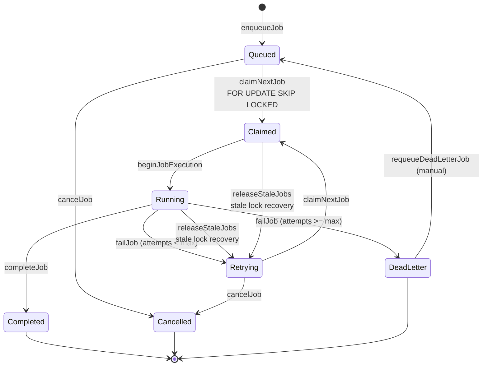
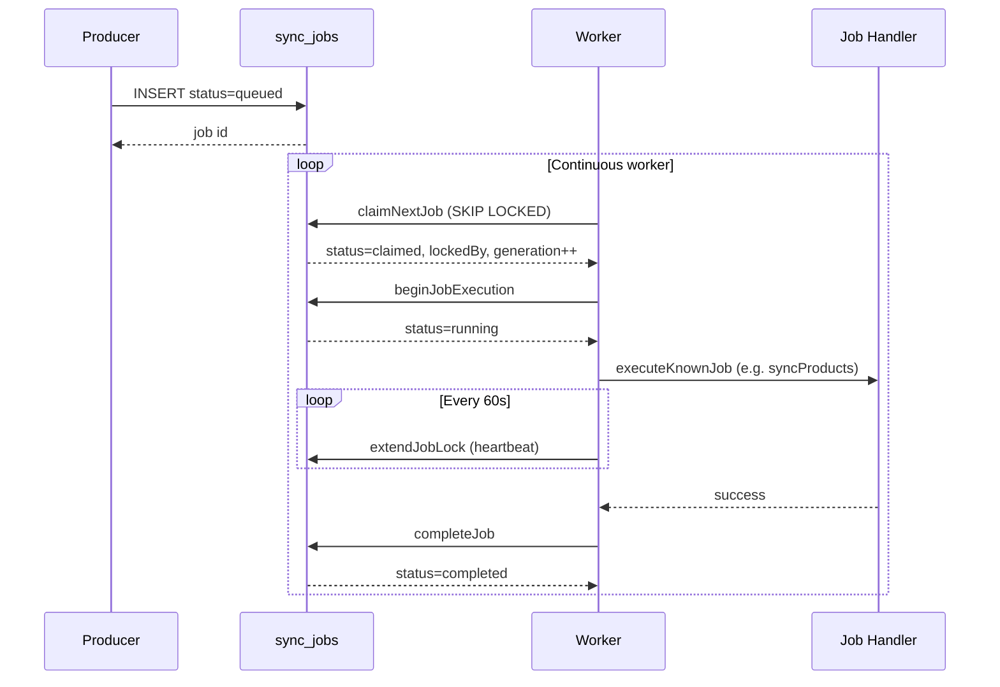
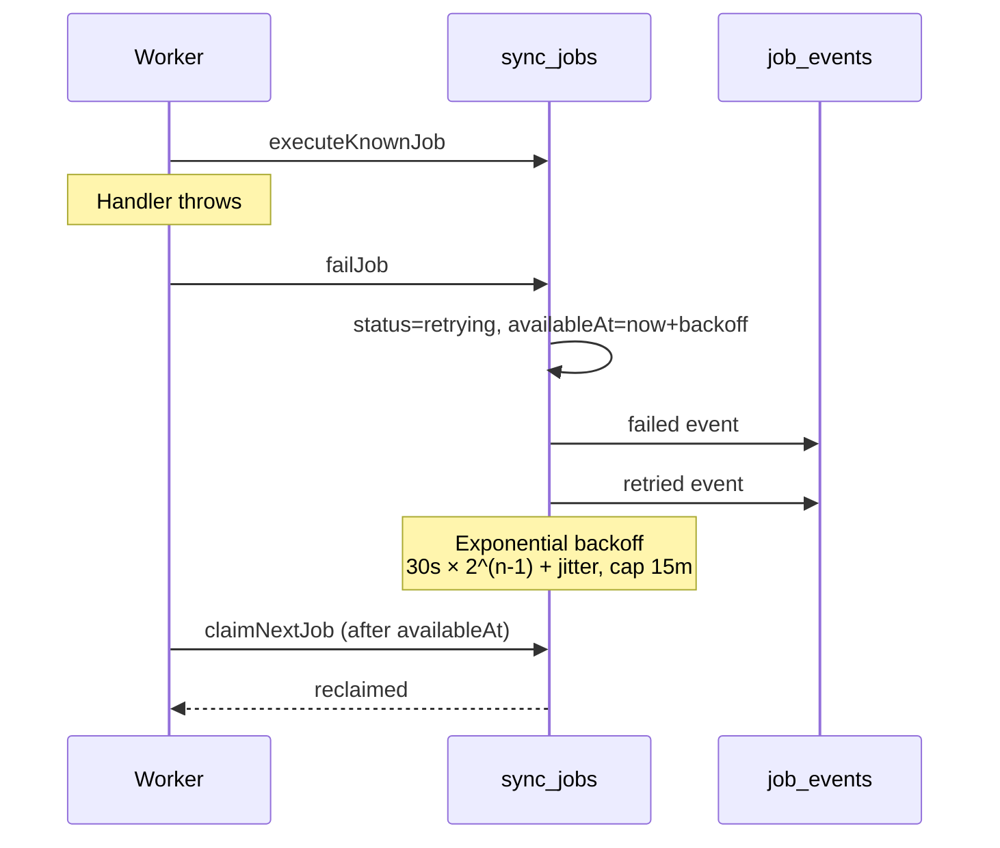

# Job Lifecycle

**Date:** 2026-07-09  
**Queue table:** `sync_jobs`  
**Audit table:** `job_events`

---

## Queue states

| State | DB enum | Description |
|-------|---------|-------------|
| **Queued** | `queued` | Waiting for worker; `availableAt <= now` |
| **Claimed** | `claimed` | Worker holds lock; execution not yet started |
| **Running** | `running` | Job handler actively executing |
| **Completed** | `completed` | Success; locks cleared |
| **Failed** | `failed` | Recorded in events; DB moves to `retrying` or `dead_letter` |
| **Retrying** | `retrying` | Scheduled retry; `availableAt` in future |
| **Cancelled** | `cancelled` | Merchant uninstall or manual cancel |
| **Dead Letter** | `dead_letter` | Max attempts exhausted |

---

## State machine

---

## Sequence diagram — happy path

---

## Sequence diagram — failure & retry

---

## Key functions

| Transition | Function | File | Lines |
|------------|----------|------|-------|
| Enqueue | `enqueueJob` / `enqueueJobWithClient` | `job.server.ts` | ~312–492 |
| Claim | `claimNextJob` | `job.server.ts` | ~494–569 |
| Start execution | `beginJobExecution` | `job.server.ts` | ~571–640 |
| Heartbeat | `extendJobLock` / `withJobHeartbeat` | `job.server.ts`, `worker.server.ts` | ~760+, ~156–197 |
| Complete | `completeJobWithClient` | `job.server.ts` | ~769–832 |
| Fail / retry | `failJobWithClient` | `job.server.ts` | ~834–920 |
| Stale recovery | `releaseStaleJobs` | `job.server.ts` | ~376–441 |
| Orphan detection | `detectOrphanJobs` | `job.server.ts` | ~820+ |
| Dead-letter replay | `requeueDeadLetterJob` | `job.server.ts` | ~705–739 |
| Cancel | `cancelJob` | `job.server.ts` | ~967+ |

---

## Retry policy

| Setting | Value |
|---------|-------|
| Base delay | 30 seconds |
| Backoff | Exponential `2^(attempts-1)` |
| Jitter | 0–5 seconds random |
| Max delay | 15 minutes |
| Default max attempts | 5 (onboarding jobs) |
| Onboarding failure | `finalizeFailedOnboardingJob` marks phase failed at dead-letter |

---

## Visibility timeout

| Setting | Default | Env override |
|---------|---------|--------------|
| Lock duration | 5 minutes | `JOB_LOCK_DURATION_MS` |
| Heartbeat interval | 60 seconds | (fixed in worker) |
| Stale grace | 2× lock duration | — |

If lock expires and heartbeat is stale, `releaseStaleJobs` returns the job to `retrying` (or `queued` if never attempted).

---

## Worker ownership

Each claim sets:

- `lockedBy` — worker instance ID
- `workerGeneration` — incremented on claim and stale release
- `lockExpiresAt` — visibility timeout deadline
- `heartbeatAt` — last heartbeat timestamp

Mutations (`completeJob`, `failJob`, `extendJobLock`) call `assertWorkerOwnership`. Mismatch throws `JobWorkerOwnershipError` and triggers onboarding repair for bootstrap jobs.

---

## Event audit trail

Every transition writes to `job_events`:

| Event | When |
|-------|------|
| `progress` | Job created |
| `claimed` | queued/retrying → claimed |
| `progress` | claimed → running |
| `completed` | Success |
| `failed` | Handler error |
| `retried` | Requeued for retry or stale release |
| `dead_lettered` | Max attempts |
| `cancelled` | Uninstall / manual |

---

## Monitoring fields

See `GET /health/worker` for:

- Current queue depth
- Average wait time (24h completed jobs)
- Average execution time (24h)
- Longest queued job age
- Total retry count (attempts sum)
- Dead-letter count
- Active worker count and heartbeat
- Orphan job list
