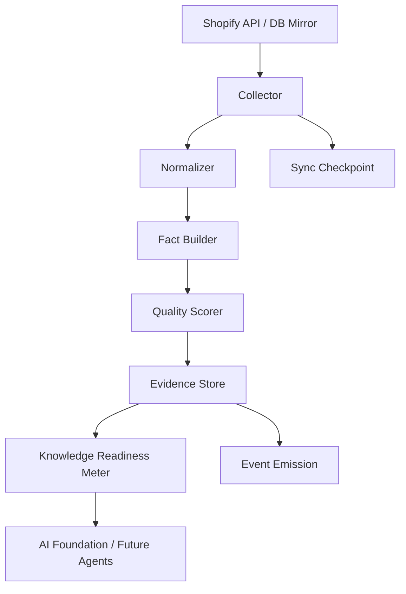
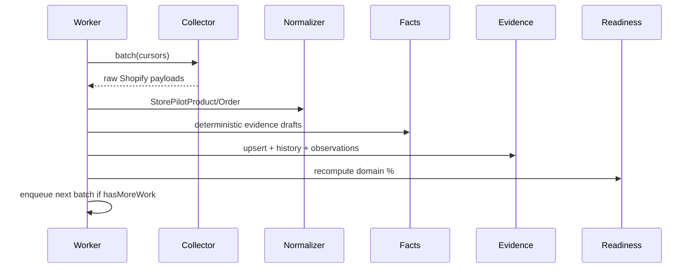

# Knowledge Ingestion Platform

Sprint 2 converts raw Shopify operational data into normalized business evidence that future AI engines consume — never raw Shopify tables.

## Architecture



## Sequence



## Folder structure

```
app/knowledge/
  collector/       Shopify GraphQL + DB mirror collectors, checkpoints
  normalizer/      Shopify → StorePilot domain models
  mapping/         Field mapping helpers
  schemas/         Zod normalized models
  fact-builder/    Deterministic business facts (no AI)
  evidence/        Prisma evidence store
  quality/         Confidence, freshness, completeness
  validators/      Reject invalid evidence
  events/          Emit ProductImported, EvidenceCreated, etc.
  pipeline/        End-to-end ingestion orchestration
  scheduler/       Job enqueue (initial, incremental, rebuild)
  readiness/       Intelligence domain readiness meter
  shared/          Types and constants
  __tests__/       Unit tests
```

## Evidence model

Each evidence record stores:

| Field | Description |
|-------|-------------|
| `entity` / `entityId` | Product, Variant, Order, Collection, … |
| `factType` | e.g. `InventoryLow`, `MissingSEO` |
| `value` | Structured JSON fact payload |
| `confidence` | 0–1 quality score |
| `freshnessMinutes` | Age since observation |
| `sourceId` | Shopify source reference |
| `observedAt` / `version` | Temporal + versioning |

Related tables: `evidence_history`, `evidence_sources`, `evidence_relationships`, `evidence_observations`.

## Knowledge Readiness Meter

During onboarding, merchants see intelligence domain progress:

| Domain | Driven by |
|--------|-----------|
| Product Intelligence | Catalog + SEO + media facts |
| Inventory Intelligence | Stock level facts |
| Pricing Intelligence | Price/margin facts |
| Operations Intelligence | Order/refund facts |
| Executive COO | Composite readiness |

UI: `KnowledgeReadinessCard` on dashboard during onboarding.

## Job types

| Job | Purpose |
|-----|---------|
| `knowledge_ingest` | Batch collect → normalize → evidence |
| `knowledge_fact_refresh` | Recompute facts from existing data |

Auto-enqueued after `bootstrap_products` completes.

## Security

Never ingests: customer email, phone, address, name, payment data, order notes. Operational business data only.

## Performance

| Catalog size | Strategy |
|--------------|----------|
| 100 | Single batch |
| 1,000 | ~20 batches @ 50 products |
| 10,000 | ~200 batches, checkpoint resume |
| 100,000 | Worker re-enqueues until `hasMoreWork=false` |

Memory: streaming batches, no full-catalog load.

## Related docs

- [EVIDENCE_MODEL.md](./EVIDENCE_MODEL.md)
- [SHOPIFY_NORMALIZATION.md](./SHOPIFY_NORMALIZATION.md)
- [FACT_GENERATION.md](./FACT_GENERATION.md)
- [SYNC_PIPELINE.md](./SYNC_PIPELINE.md)

## Remaining for Sprint 3

- Knowledge Graph reasoning layer
- Event bus consumers
- GA4/GSC/Clarity connectors into evidence
- Executive COO agent wired to evidence store
- Redis-backed evidence cache
