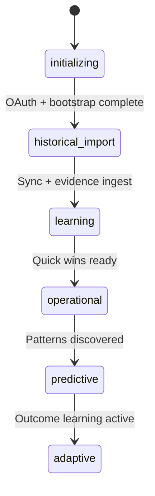

# Learning Readiness

Replaces zero-based progress bars with **stages**, **historical confidence**, and merchant-readable explanations.

## Stages



| Stage | Merchant Label | Start Criteria | Completion Criteria |
|-------|----------------|----------------|---------------------|
| `initializing` | Initializing | Install | Bootstrap profile persisted |
| `historical_import` | Historical Import | Bootstrap complete | Products/orders/inventory synced |
| `learning` | Learning | Evidence ingest running | Graph + DNA seeded |
| `operational` | Operational | Quick wins available | Sprint 4C |
| `predictive` | Predictive | Patterns detected | Sprint 5 |
| `adaptive` | Adaptive | Outcome loop active | Sprint 5+ |

## Confidence Model

**Never starts at 0%** for stores with history.

```
overall = weighted domain confidences
domain  = historical baseline + catalog signals + complexity scores
```

Example after bootstrap (no sync yet):

| Domain | Typical Bootstrap Confidence |
|--------|------------------------------|
| Inventory | 70–85% |
| Products | 65–80% |
| Operations | 55–75% |
| Pricing | 45–60% |
| SEO | 35–50% |
| Seasonality | 15–35% |

Executive COO and Prediction remain **Not Ready** until later sprints.

## UI

`LearningBootstrapCard` shows:

- Merchant headline (*"Analyzing approximately 18 months…"*)
- Learning stage badge
- Overall confidence + ETA
- Import step checklist (Products, Orders, Inventory, Collections, Business DNA)
- Per-domain confidence bars with velocity status labels

## API

- `getLearningReadiness(storeId)`
- `getLearningReadinessForUi(storeId, onboardingPhase?)`

## Relation to Knowledge Readiness

`knowledge_readiness` (Sprint 2) tracks evidence fact coverage post-ingest.

`learning_readiness` (Sprint 4A) tracks **merchant journey stages** and **bootstrap confidence**.

Both coexist — learning readiness is shown during onboarding; knowledge readiness updates after ingest.
