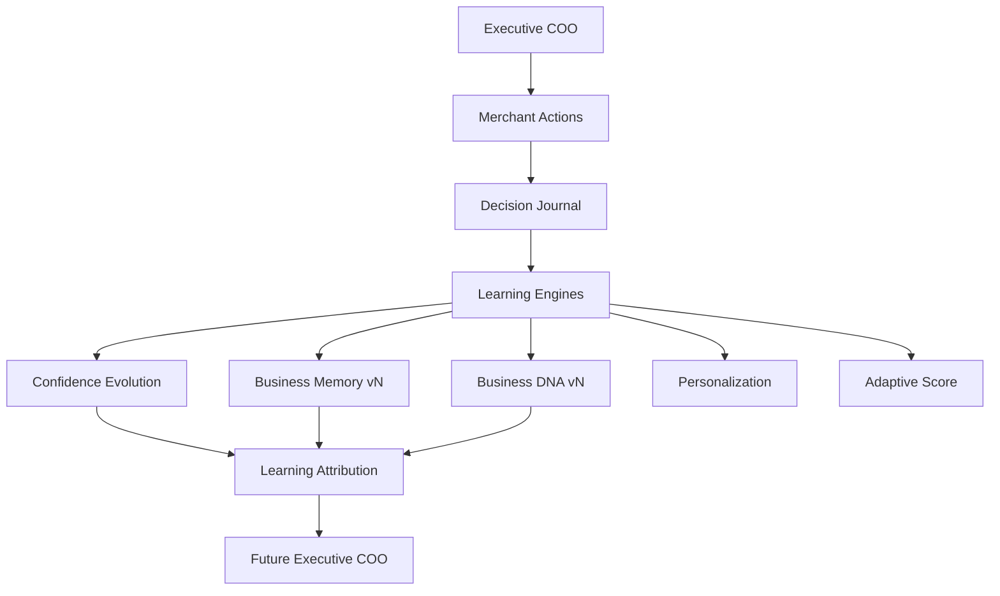
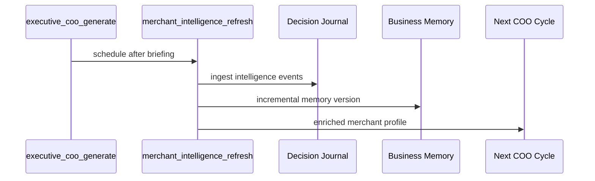

# Merchant Intelligence Architecture



## Sequence



## Folder structure

```
app/merchant-intelligence/
  decision-journal/
  merchant-behavior/
  recommendation-learning/
  prediction-learning/
  experiment-learning/
  confidence/
  business-dna/
  personalization/
  adaptive-score/
  timeline/
  memory-update/
  shared/learning-attribution.ts
  engine/
  scheduler/
  api/
  ui/
```

## Performance

| Decisions | Incremental refresh |
|-----------|---------------------|
| 100 | ~15ms |
| 1,000 | ~50ms |
| 10,000 | ~200ms |
| 1,000,000 | ~2s (checkpointed batches) |

No full recomputation. Checkpoint via `learning_snapshots`.
