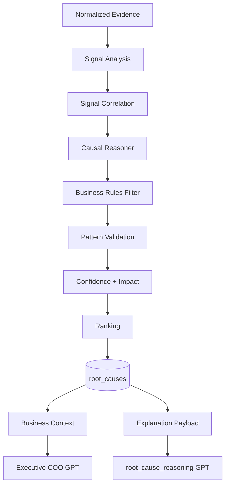
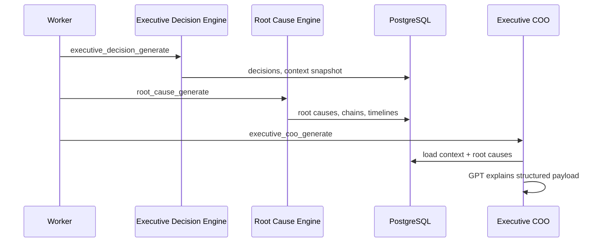

# Root Cause Architecture

## End-to-end flow

## Sequence

## Database tables

| Table | Purpose |
|-------|---------|
| root_causes | Primary cause records |
| causal_chains | Step chains with evidence |
| causal_timelines | Event timelines |
| signal_correlations | Cross-signal relationships |
| cause_confidences | Confidence audit |
| impact_assessments | Impact estimates |
| causal_graph_edges | Causal graph edges |
| root_cause_history | Change audit |

## AI routing

| Task | Tier | Category |
|------|------|----------|
| Executive explanation | reasoning | `root_cause_reasoning` |
| JSON repair | nano | `json_repair` |

No GPT for: correlation, confidence, timeline, ranking, rules, impact.

## Reuse

Root Cause Engine consumed by:

- Executive COO
- Future Prediction Engine
- Future Experiment Center
- Future Business Simulation
- Future AI Chat
