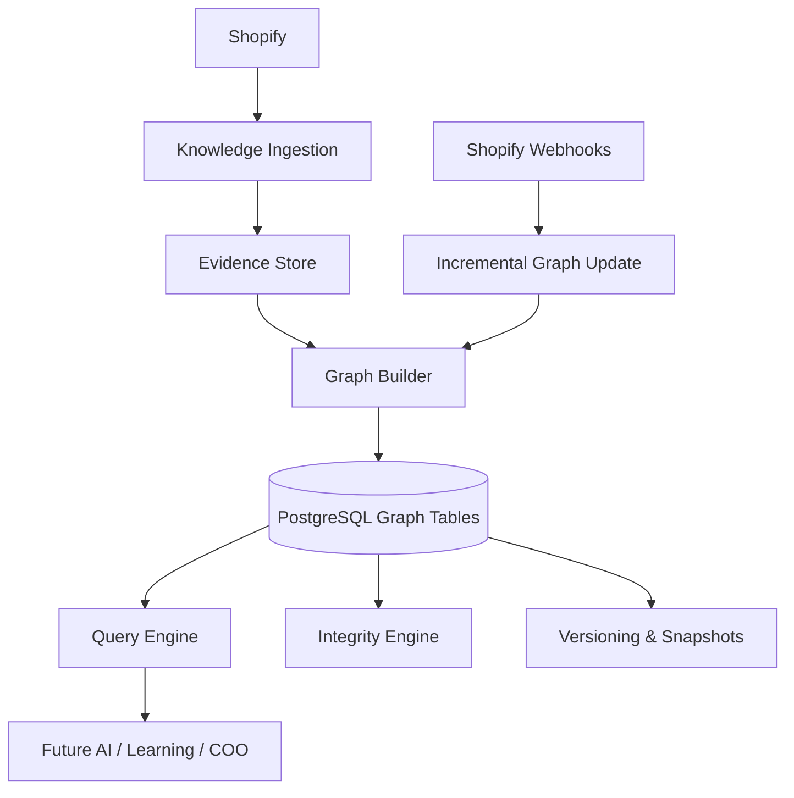

# Store Knowledge Graph

StorePilot's Store Knowledge Graph is the proprietary intelligence layer between the Knowledge Ingestion Platform and every future AI agent. It transforms isolated business facts into connected business understanding.

## Mission

- Model merchant business entities as **nodes** and **relationships** as **evidence-bound edges**
- Support incremental updates from webhooks without full rebuilds
- Provide deterministic graph traversal APIs for downstream intelligence engines
- Maintain explainability: every relationship traces to evidence

## Architecture

## Module Layout

| Path | Responsibility |
|------|----------------|
| `builder/` | Consumes evidence, produces nodes, edges, snapshots |
| `nodes/` | Node persistence and canonical key upserts |
| `edges/` | Edge persistence with evidence provenance |
| `relationships/` | Automatic relationship inference from facts |
| `query/` | Pure graph traversal (neighbors, paths, influence) |
| `resolver/` | High-level graph views (product, collection, vendor) |
| `versioning/` | Version bumps, immutable snapshots, diffs |
| `snapshots/` | Snapshot export surface |
| `history/` | Historical comparison surface |
| `integrity/` | Broken edge detection and safe repair |
| `metrics/` | Graph statistics and coverage scores |
| `search/` | Fast node/edge lookup index |
| `api/` | Public graph API for future engines |
| `cache/` | In-memory neighborhood cache |
| `events/` | Graph lifecycle event emission |
| `scheduler/` | Worker job scheduling |

## Critical Rules

1. **AI never reads Shopify tables directly** — consume the graph
2. **Every edge requires evidence** — provenance is mandatory
3. **Incremental by default** — webhooks update scoped subgraphs only
4. **PostgreSQL-first** — no dedicated graph DB in V1
5. **Privacy-by-architecture** — no customer PII nodes

## Related Documentation

- [GRAPH_ARCHITECTURE.md](./GRAPH_ARCHITECTURE.md)
- [GRAPH_SCHEMA.md](./GRAPH_SCHEMA.md)
- [GRAPH_RELATIONSHIPS.md](./GRAPH_RELATIONSHIPS.md)
- [GRAPH_QUERY_ENGINE.md](./GRAPH_QUERY_ENGINE.md)
- [GRAPH_VERSIONING.md](./GRAPH_VERSIONING.md)
- [GRAPH_INTEGRITY.md](./GRAPH_INTEGRITY.md)
- [BUSINESS_DNA.md](./BUSINESS_DNA.md)

## Worker Integration

| Job Type | Trigger |
|----------|---------|
| `knowledge_graph_build` | After knowledge ingest completes, or manual full build |
| `knowledge_graph_incremental` | Product/inventory/order webhooks |

## Public API

Use `createKnowledgeGraphApi(storeId)` from `app/knowledge/graph/api/graph-api.ts` for all graph reads.
