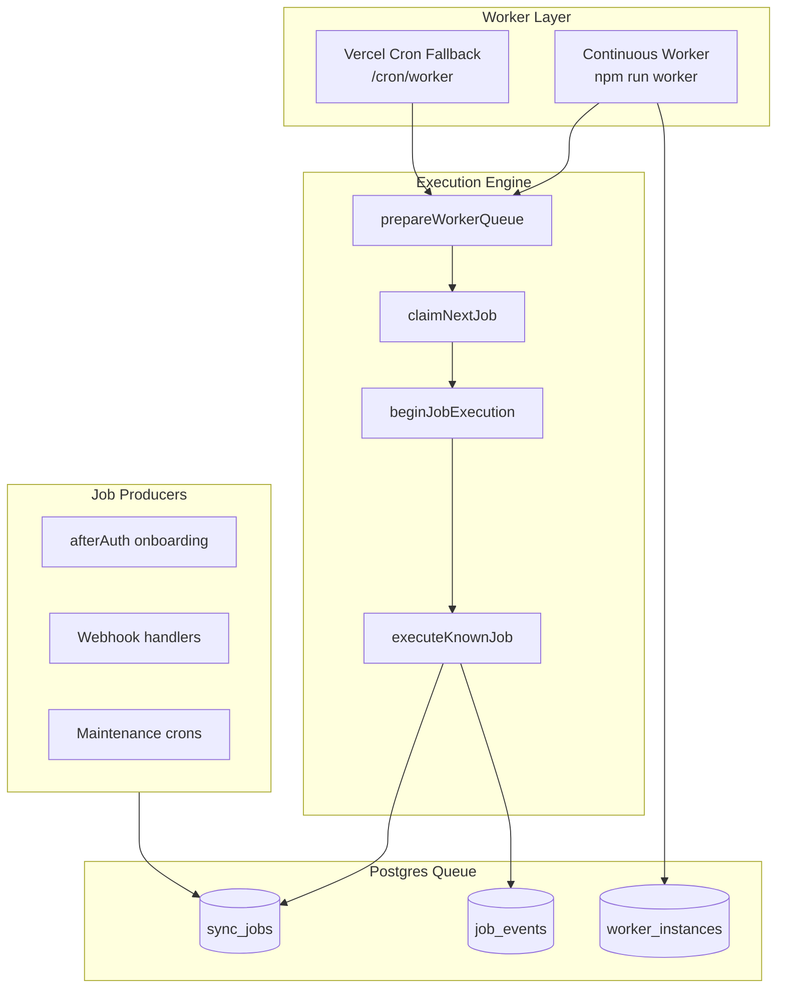

# Worker Architecture

**Date:** 2026-07-09  
**Scope:** Infrastructure only — no business logic, Shopify sync, or AI changes

---

## Overview

StorePilot uses a **Postgres-backed job queue** (`sync_jobs`) with a **continuous worker process** as the primary execution path. Vercel Cron (`POST /cron/worker`) remains as a **fallback** for environments without a dedicated worker deployment.



---

## Components

| Component | File | Role |
|-----------|------|------|
| Job queue service | `app/services/job.server.ts` | Enqueue, claim, lock, heartbeat, retry, dead-letter |
| Worker engine | `app/services/worker.server.ts` | Job dispatch, onboarding finalization hooks |
| Continuous runtime | `app/services/worker-runtime.server.ts` | Poll loop, graceful shutdown, orphan recovery |
| Worker registry | `app/services/worker-registry.server.ts` | Instance registration, heartbeat, uptime |
| Queue metrics | `app/services/worker-metrics.server.ts` | Depth, latency, throughput |
| Health aggregation | `app/services/worker-health.server.ts` | `/health/worker` payload |
| Cron fallback | `app/routes/cron.worker.tsx` | HTTP-triggered batch cycles |
| Worker entrypoint | `scripts/worker.ts` | `npm run worker` |
| Worker container | `Dockerfile.worker` | Dedicated worker deployment |

---

## Deployment modes

### Primary — Continuous worker (recommended)

```bash
npm run worker
```

Deploy `Dockerfile.worker` to Railway, Fly.io, Render, or any container platform with:

- `DATABASE_URL` (pooler, `connection_limit=1`)
- `DIRECT_URL` (migrations)
- `CRON_SECRET`, Shopify env vars (worker loads store sessions)
- Optional tuning: `WORKER_POLL_INTERVAL_MS`, `WORKER_BATCH_SIZE`, `JOB_LOCK_DURATION_MS`

### Fallback — Vercel Cron

`vercel.json` schedules `/cron/worker` every **2 minutes** (`*/2 * * * *`). Requires `CRON_SECRET` (Bearer auth auto-injected by Vercel).

Use when continuous worker is unavailable; not sufficient alone for low-latency onboarding.

---

## Multi-worker safety

| Mechanism | Implementation |
|-----------|----------------|
| Exclusive claim | `FOR UPDATE SKIP LOCKED` in `claimNextJob` |
| Worker ownership | `lockedBy` + `workerGeneration` on every mutation |
| Idempotent enqueue | Unique `idempotencyKey` |
| Stale lock recovery | `releaseStaleJobs` + generation bump |
| Orphan detection | `detectOrphanJobs` vs active `worker_instances` |
| Heartbeat extension | `withJobHeartbeat` every 60s during execution |

Multiple workers can run concurrently. Each claims distinct jobs; stale/crashed workers lose ownership via generation increment.

---

## Environment variables

| Variable | Default | Purpose |
|----------|---------|---------|
| `WORKER_POLL_INTERVAL_MS` | 2000 | Idle poll interval |
| `WORKER_BATCH_SIZE` | 3 | Jobs per cycle |
| `WORKER_HEARTBEAT_INTERVAL_MS` | 15000 | Instance heartbeat |
| `WORKER_STALE_THRESHOLD_MS` | 90000 | Worker considered offline |
| `JOB_LOCK_DURATION_MS` | 300000 | Visibility timeout |
| `CRON_JOB_BATCH_SIZE` | 3 | Cron fallback batch size |

---

## Health & monitoring

| Endpoint | Purpose |
|----------|---------|
| `GET /health/worker` | Queue depth, latency, active workers, orphans, alerts |
| `GET /health/monitor` | Full platform report including worker check |
| `GET /cron/worker` | Cron auth health (unauthorized GET) |

---

## AI readiness

The worker engine already dispatches AI-adjacent job types (`metrics_recompute`, `recommendations_generate`, `executive_brief_generate`) without modification. Continuous processing ensures AI pipeline jobs are not blocked by daily cron schedules.

---

## Related docs

- [JOB_LIFECYCLE.md](./JOB_LIFECYCLE.md) — state machine and transitions
- [WORKER_INFRASTRUCTURE_REPORT.md](./WORKER_INFRASTRUCTURE_REPORT.md) — audit findings
- [WORKER_MIGRATION_PLAN.md](./WORKER_MIGRATION_PLAN.md) — production rollout
- [F42_WORKER_CRON_DEPLOYMENT.md](./F42_WORKER_CRON_DEPLOYMENT.md) — cron fallback setup
