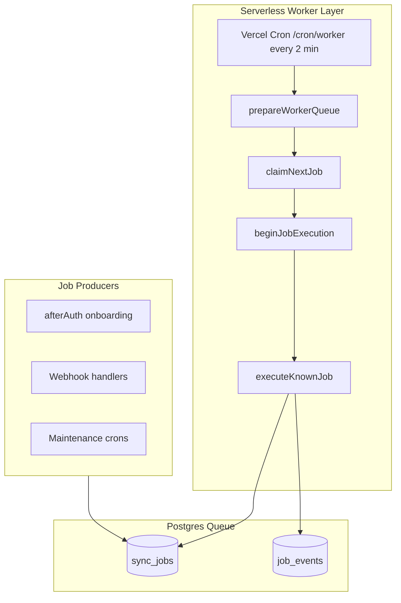

# Worker Architecture

**Date:** 2026-07-10 (RC3.5 serverless alignment)  
**Scope:** Infrastructure only — no business logic changes

---

## Overview

StorePilot uses a **Postgres-backed job queue** (`sync_jobs`) executed by **Vercel Cron** in production. Each cron invocation runs a bounded batch cycle through the shared worker engine. No persistent background process is required.

**Production topology:** GitHub → Vercel → Vercel Cron → Supabase → Shopify

---

## Components

| Component | File | Role |
|-----------|------|------|
| Job queue service | `app/services/job.server.ts` | Enqueue, claim, lock, heartbeat, retry, dead-letter |
| Worker engine | `app/services/worker.server.ts` | Job dispatch, onboarding finalization hooks |
| Cron entry | `app/routes/cron.worker.tsx` | Authorized HTTP batch cycles |
| Cron dispatch routes | `app/routes/cron.dispatch.$jobId.tsx` | Maintenance and intelligence scheduling |
| Cron registry | `app/services/cron-scheduler.server.ts` | Schedule definitions + runners |
| Queue metrics | `app/services/worker-metrics.server.ts` | Depth, latency, throughput |
| Health aggregation | `app/services/worker-health.server.ts` | `/health/worker` payload |
| Cron auth | `app/services/cron-auth.server.ts` | `CRON_SECRET` Bearer validation |

---

## Production deployment — Vercel Cron

`vercel.json` schedules:

| Path | Schedule | Purpose |
|------|----------|---------|
| `/cron/worker` | `*/2 * * * *` | Process queued `sync_jobs` |
| `/cron/dispatch/retry-queue` | `*/5 * * * *` | Release stale locks |
| `/cron/dispatch/expired-sessions` | `0 * * * *` | Purge expired Shopify sessions |
| `/cron/dispatch/privacy-pii-scan` | `0 1 * * *` | PII sampling audit |
| `/cron/dispatch/cleanup-jobs` | `0 2 * * *` | Webhook + lease cleanup |
| `/cron/dispatch/knowledge-refresh` | `0 3 * * *` | Enqueue connector sync jobs |
| `/cron/dispatch/learning-engine` | `0 4 * * *` | Update learning profiles |
| `/cron/dispatch/token-migration` | `0 5 * * *` | Encrypt legacy tokens |
| `/cron/dispatch/daily-operating-plan` | `0 6 * * *` | Enqueue executive brief jobs |
| `/cron/dispatch/recommendation-refresh` | `0 7,19 * * *` | Enqueue recommendation jobs |
| `/cron/dispatch/scope-drift-monitor` | `0 8 * * *` | Scope drift alerts |
| `/cron/dispatch/metrics-aggregation` | `0 */6 * * *` | Enqueue metrics recompute |

Requires `CRON_SECRET` in Vercel production (Bearer auth auto-injected by Vercel Cron).

---

## Execution flow

1. Vercel Cron invokes `GET /cron/worker` with `Authorization: Bearer $CRON_SECRET`
2. Route assigns ephemeral worker ID `cron-worker-{timestamp}`
3. `runWorkerCycle()` → `prepareWorkerQueue()` (stale lock release + onboarding repair)
4. Loop up to `CRON_JOB_BATCH_SIZE` (default 3, max 10): `claimNextJob` → `executeKnownJob`
5. Job completion may enqueue pipeline continuation jobs for the next cron tick

---

## Multi-worker safety

| Mechanism | Implementation |
|-----------|----------------|
| Exclusive claim | `FOR UPDATE SKIP LOCKED` in `claimNextJob` |
| Worker ownership | `lockedBy` + `workerGeneration` on every mutation |
| Idempotent enqueue | Unique `idempotencyKey` |
| Stale lock recovery | `releaseStaleJobs` in every worker cycle + retry-queue cron |
| Heartbeat extension | `withJobHeartbeat` every 60s during execution |
| Cron lock semantics | Ephemeral `cron-worker-*` IDs excluded from false orphan detection |

Concurrent cron invocations are safe — each claims distinct jobs via Postgres row locks.

---

## Environment variables

| Variable | Default | Purpose |
|----------|---------|---------|
| `CRON_SECRET` | — | **Required** — authorizes cron routes |
| `CRON_JOB_BATCH_SIZE` | 3 | Jobs per cron invocation (max 10) |
| `JOB_LOCK_DURATION_MS` | 300000 | Visibility timeout |
| `WORKER_BATCH_SIZE` | 3 | Alias used when batch size unset |

Optional tuning vars (`WORKER_POLL_INTERVAL_MS`, etc.) apply only to local `npm run worker` development — not production.

---

## Health & monitoring

| Endpoint | Purpose |
|----------|---------|
| `GET /health/worker` | Queue depth, cron config, execution mode, alerts |
| `GET /health/monitor` | Full platform report including worker check |
| `GET /health/ready` | Startup readiness (prompts, migrations, env) |
| `GET /cron/worker` | Cron auth probe (unauthorized GET returns config status) |

**Serverless health model:** `/health/worker` returns healthy when `CRON_SECRET` is configured and queue metrics are acceptable. It does **not** require `activeWorkers > 0`.

See [RC35_SERVERLESS_HEALTH_MODEL.md](./release/RC35_SERVERLESS_HEALTH_MODEL.md).

---

## Legacy artifacts (not used in production)

| Artifact | Status |
|----------|--------|
| `scripts/worker.ts` + `npm run worker` | **Optional** — local dev / load testing only |
| `Dockerfile.worker` | **Legacy** — not part of Vercel deployment |
| `railway.toml` | **Legacy** — not part of Vercel deployment |
| `worker_instances` table | **Optional telemetry** — not required for cron execution |

---

## Related docs

- [JOB_LIFECYCLE.md](./JOB_LIFECYCLE.md) — state machine and transitions
- [RC4A_WORKER_ARCHITECTURE_CERTIFICATION.md](./release/RC4A_WORKER_ARCHITECTURE_CERTIFICATION.md) — architecture audit
- [SERVERLESS_PRODUCTION_CERTIFICATE.md](./release/SERVERLESS_PRODUCTION_CERTIFICATE.md) — production certification
- [DEPLOYMENT_PLAN.md](./release/DEPLOYMENT_PLAN.md) — deployment sequence
