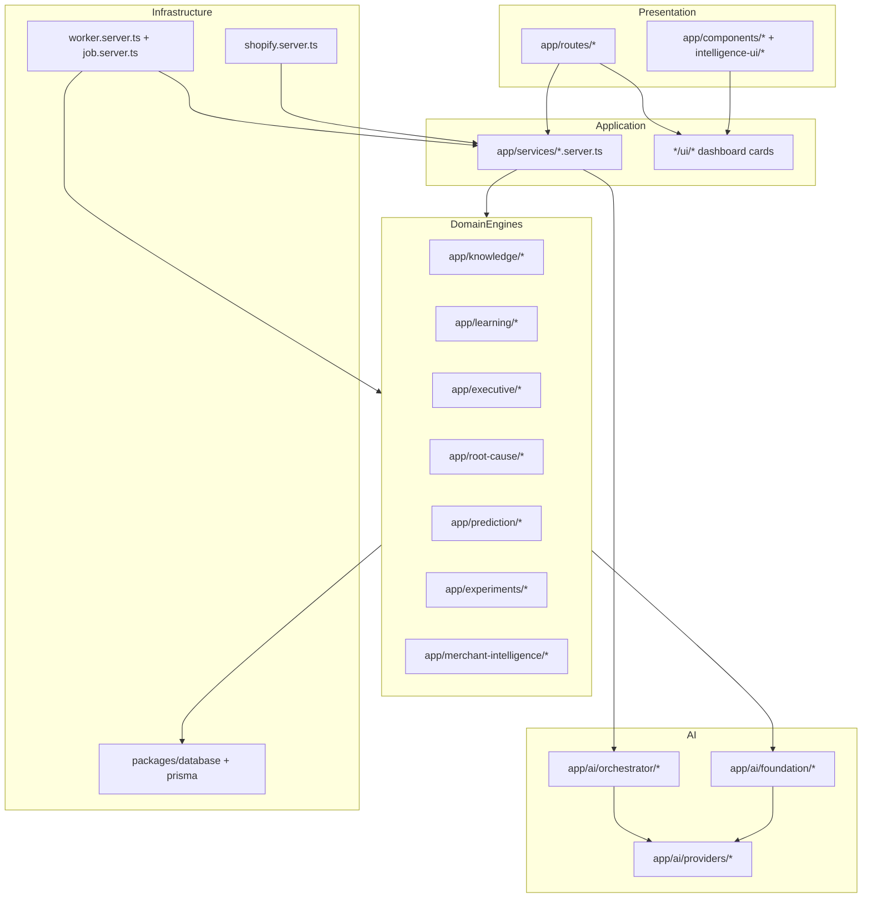

# Architecture Audit — StorePilot Phase A

**Date:** 2026-07-10  
**Scope:** Full `app/` monolith, domain engines, workers, Shopify integration  
**Method:** Static analysis, module tracing, subagent exploration, test verification (3,005 passing)

---

## Executive Summary

StorePilot implements a **layered intelligence pipeline** with clear domain modules (Knowledge → Learning → Executive → Root Cause → Prediction → Experiments → Merchant Intelligence). The architecture is **conceptually sound** but has **three production risks**:

1. **Dual AI stacks** — AI Foundation vs V2 Orchestrator coexist; 9 services bypass Foundation.
2. **Dual Executive COO paths** — `coo-service.ts` (Foundation) vs `executive-coo.server.ts` (V2).
3. **Incomplete GDPR shop redact** — `deleteShopDataByDomain()` omits ~50+ intelligence tables with `onDelete: Restrict`.

---

## Intended Architecture

```
Shopify Webhooks / Sync
        ↓
Knowledge Ingestion (connectors, normalization)
        ↓
Knowledge Graph Build
        ↓
Historical Intelligence → Business Memory
        ↓
Quick Wins → Executive Decisions → Root Causes
        ↓
Predictions → Experiments → Executive COO → Merchant Intelligence
        ↓
UI Workspaces (intelligence-ui) + Dashboard
```

**Worker orchestration:** PostgreSQL `sync_jobs` queue with chained idempotency keys in `app/services/worker.server.ts`.

---

## Architecture Compliance Report

| Rule | Status | Evidence |
|------|--------|----------|
| AI calls via AI Foundation | **Partial** | Only `coo-service.ts`, `explanation-service.ts` use `createAIFoundationClient()`. Nine services use `getAIOrchestrator()` — `product-intelligence.server.ts`, `executive-coo.server.ts`, etc. |
| Shopify via Knowledge Ingestion | **Mostly compliant** | Orders/products sync in `orders.server.ts`, `product.server.ts`; GraphQL excludes customer PII |
| Knowledge Graph via graph-api | **Compliant** | Engines use `createKnowledgeGraphApi()`; UI workspaces consume same API |
| Deterministic engines (no GPT) | **Compliant** | Prediction, experiments, root cause, merchant intelligence engines are deterministic |
| GPT only for explanations | **Mostly compliant** | Executive COO and root cause explanations gated on `AI_PLATFORM_ENABLED` |
| Business logic not in routes | **Mostly compliant** | Routes delegate to `*.server.ts` loaders; intelligence routes thin |
| Business logic not in components | **Mostly compliant** | Dashboard cards are presentational; workspace views in `intelligence-workspace-views.tsx` contain JSX mapping only |
| Multi-tenant store isolation | **Compliant** | Queries scoped by `storeId`; auth via `authenticate.admin` |

---

## Cross-Layer Violations

### Critical

| Violation | Files | Impact |
|-----------|-------|--------|
| V2 AI bypasses Foundation pipeline | `app/services/*-intelligence.server.ts` (9 files), `app/ai/orchestrator/ai-orchestrator.server.ts` | No circuit breaker, no model routing, split cost/telemetry |
| Executive COO duplicated | `app/executive/coo/coo-service.ts` vs `app/services/executive-coo.server.ts`; onboarding uses V2, scheduler uses Foundation | Inconsistent behavior, double maintenance |
| `shop/redact` incomplete deletion | `app/services/gdpr.server.ts:258-297` | FK failures or residual data after GDPR shop redact |

### High

| Violation | Files | Impact |
|-----------|-------|--------|
| Fire-and-forget pipeline chaining | `app/services/worker.server.ts` — `void scheduleX().catch(() => undefined)` | Silent pipeline failures |
| Static idempotency keys block re-runs | `worker.server.ts`, schedulers | Cannot re-trigger intelligence pipeline after completion |
| Placeholder routes in production nav paths | `app/routes/app.issues.tsx`, `app.reports.tsx`, `app.additional.tsx` | Dead-end UX, maintenance burden |

### Medium

| Violation | Files | Impact |
|-----------|-------|--------|
| Business mapping in views layer | `app/services/intelligence-workspace-views.tsx` (674 lines) | Blurs server/view boundary; acceptable for Sprint 10 but should split |
| In-memory Shopify idempotency | `app/shopify-automation/shopify-idempotency.ts` | Lost on restart/multi-instance |
| Monitoring uses V2 health | `app/services/monitoring.server.ts` | Foundation health not exposed |

---

## Layer Dependency Graph



---

## Module Dependency Graph (Intelligence Pipeline)


**Scheduler files:** `app/knowledge/graph/scheduler/`, `app/learning/historical/scheduler/`, `app/executive/scheduler/`, etc.

---

## Circular Import Risk

No automated circular dependency scan was run. Manual review shows:

- `app/services/*` → domain `api/*` → `db.server.ts` (clean)
- `app/ai/orchestrator` → `app/ai/providers` → `openai-client.ts` (clean)
- Risk area: `intelligence-workspace.server.ts` imports from many domain APIs — monitor as file grows (752 lines)

**Recommendation:** Add `madge` or `dependency-cruiser` to CI.

---

## Refactoring Priority (Architecture)

| Priority | Item | Effort |
|----------|------|--------|
| 🔴 Critical | Unify AI stack — migrate 9 orchestrator services to Foundation OR make orchestrator wrap Foundation | 2–3 weeks |
| 🔴 Critical | Complete `deleteShopDataByDomain()` for all store-scoped tables | 3–5 days |
| 🟠 High | Unify Executive COO to single path | 3–5 days |
| 🟠 High | Replace fire-and-forget pipeline chaining with awaited enqueue + failure alerts | 2–3 days |
| 🟡 Medium | Remove or wire placeholder routes (`app.issues`, `app.reports`, `app.additional`) | 1–2 days |
| 🟡 Medium | Split `intelligence-workspace-views.tsx` into domain view modules | 2–3 days |
| 🟢 Low | Add dependency graph CI check | 1 day |

---

## Strengths

- Domain modules are well-separated with consistent patterns: `api/`, `engine/`, `scheduler/`, `shared/types.ts`, `ui/`
- Deterministic intelligence engines with evidence IDs and idempotent upserts
- Worker queue with SKIP LOCKED, heartbeats, stale lock recovery, dead-letter
- Privacy-by-architecture enforced at order sync and schema level
- Comprehensive test suite (273 test files, 3,005 tests)
