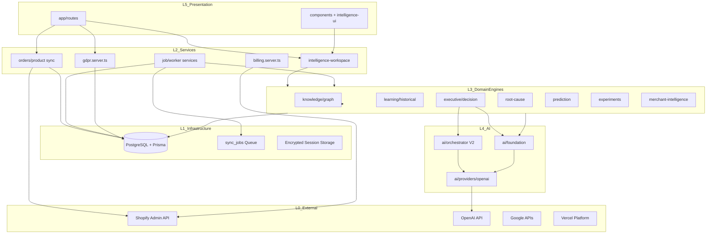
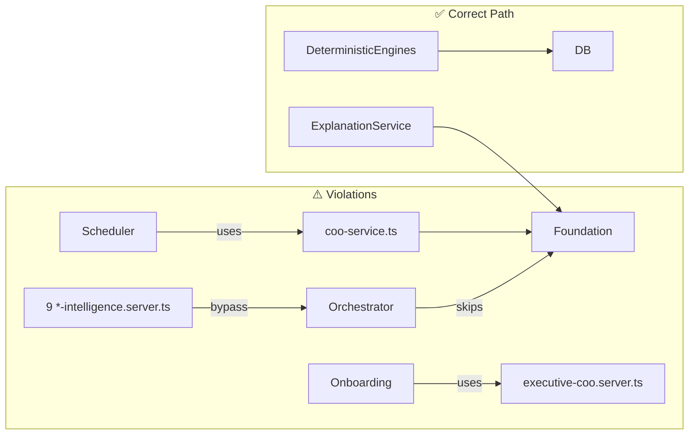

# Dependency Graph — StorePilot Phase A

**Date:** 2026-07-10

---

## Layer Dependency (Mermaid)



---

## Intelligence Pipeline Dependency

```mermaid
flowchart LR
  subgraph Ingestion
    WH[Webhooks] --> Sync
    Sync --> Facts[Evidence/Facts]
  end

  Facts --> KG[Knowledge Graph Build]
  KG --> HI[Historical Intelligence]
  HI --> BM[Business Memory]
  BM --> QW[Quick Wins]
  QW --> ED[Executive Decisions]
  ED --> RC[Root Causes]
  RC --> PR[Predictions]
  PR --> EX[Experiments]
  EX --> COO[Executive COO]
  COO --> MI[Merchant Intelligence]
  MI --> UI[Intelligence Workspaces]
```



---

## Module Coupling Hotspots

| Module | Fan-In | Fan-Out | Risk |
|--------|--------|---------|------|
| `db.server.ts` | Very high | 1 (packages/database) | Expected |
| `worker.server.ts` | Medium | All domain schedulers | God dispatcher |
| `intelligence-workspace.server.ts` | Low | 8+ domain APIs | Growing aggregator |
| `shopify.server.ts` | High | Auth + billing + onboarding | Bootstrap complexity |
| `ai/orchestrator` | 9 services | providers + prisma | Bypass hub |

---

## Cross-Layer Violations (Dependency)



---

## Package Dependencies

```
store-pilot/
├── app/                    (main application)
├── packages/database/      (Prisma instrumentation, pooling, retry)
├── prisma/                 (schema, migrations)
├── scripts/                (worker, deploy, audit)
└── extensions/*            (workspace — empty)
```

**External runtime deps:** react, react-router, @shopify/*, @prisma/client, openai, zod

---

## Recommended CI Additions

1. `madge --circular app/` — detect circular imports
2. `dependency-cruiser` — enforce layer rules (routes → services → domain → db)
3. Bundle size budget on `react-router build`

---

## Module Count Summary

| Area | Files (approx) |
|------|----------------|
| app/ total TS/TSX | ~1,217 |
| Route modules | 56 |
| Service *.server.ts | 87 |
| Test files | 273 |
| Prisma models | 112 |
| Docs (architecture) | 81 |
