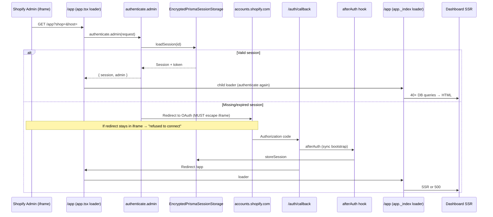

# Production Performance & Auth Investigation

**Date:** 2026-07-10  
**Environment:** Production — `https://store-pilot-eta.vercel.app`  
**Build SHA (local):** current workspace HEAD  
**Mode:** Investigation only — **no fixes implemented**

---

## Executive Summary

Three production symptoms share a common root: **serverless functions block on heavy synchronous work while the database is under connection-pool pressure**.

| Symptom | Primary root cause | Confidence |
|---------|-------------------|------------|
| `accounts.shopify.com refused to connect` → `Unexpected Server Error` on install | OAuth/login page loaded inside embedded iframe (session missing/expired) followed by SSR loader or `afterAuth` failure (timeout/DB pool) | **High** |
| LCP ~18–19 seconds | Dashboard index loader runs **40+ sequential DB round-trips** across 7 intelligence workspaces before first byte; no streaming/Suspense | **High** |
| `[db-slow-query]` during cron | Unindexed `SyncJob.count(status=…)` fan-out (7× per health/cron cycle), `StoreOnboarding.findMany` with `include: { currentJob }`, pool contention on Supabase pgbouncer | **High** |

Live probe (`GET /health/monitor`, 2026-07-10T15:23:44Z): database latency **6,795 ms** for `SELECT 1`, p95 query duration **10,547 ms**, **2,099 / 2,099** queries in instance window flagged slow. Pool audit warns missing `connection_limit` and `pool_timeout` on `DATABASE_URL`.

---

## PART 1 — Authentication Investigation

### 1.1 End-to-end flow (merchant click → dashboard)



### 1.2 Code path map

| Step | Route / module | What happens |
|------|----------------|--------------|
| 1. Merchant opens app | Shopify Admin embedded iframe | Loads `{SHOPIFY_APP_URL}/app?shop={shop}&host={host}` |
| 2. Layout auth | `app/routes/app.tsx` L9–14 | `await authenticate.admin(request)` — first auth gate |
| 3. App Bridge shell | `app/routes/app.tsx` L20 | `<AppProvider embedded apiKey={…}>` |
| 4. Index auth + data | `app/routes/app._index.tsx` L75–76 | **Second** `authenticate.admin(request)` |
| 5. OAuth catch-all | `app/routes/auth.$.tsx` L6–9 | `authenticate.admin` for `/auth/*` subpaths |
| 6. Manual login (non-embedded) | `app/routes/auth.login/route.tsx` L9–16 | `login(request)` with `AppProvider embedded={false}` |
| 7. Session persistence | `app/services/encrypted-session-storage.server.ts` | Encrypt/decrypt tokens; Prisma `Session` table |
| 8. Post-OAuth bootstrap | `app/shopify.server.ts` L80–188 | **`afterAuth` hook — fully synchronous** |
| 9. Error surface | `app/routes/app.tsx` L44–46 | `boundary.error(useRouteError())` → Shopify **"Unexpected Server Error"** |
| 10. Root fallback | `app/root.tsx` L34–70 | Generic "Something went wrong" (non-boundary routes) |

### 1.3 Configuration verification

| Setting | Expected (Partner / TOML) | Code / env | Status |
|---------|---------------------------|------------|--------|
| `application_url` | `https://store-pilot-eta.vercel.app` | `shopify.app.toml` L5 | ✅ Match |
| `embedded` | `true` | `shopify.app.toml` L6; `AppProvider embedded` | ✅ Match |
| Redirect URL | `…/auth/callback` | `shopify.app.toml` L70–72; `authPathPrefix: "/auth"` | ✅ Match |
| `SHOPIFY_APP_URL` | Same as application_url | `shopify.server.ts` L73 | ✅ Required in prod (health check confirms configured) |
| Scopes | `read_products,read_inventory,write_products,read_orders` | `shopify.app.toml` L12; `SCOPES` env | ✅ Match |
| API version | `2025-10` | `ApiVersion.October25` | ✅ Match |

No redirect URL mismatch or scope drift detected in configuration. Failures are **runtime/behavioral**, not static config.

### 1.4 Where authentication breaks

#### Symptom A: `accounts.shopify.com refused to connect`

**Mechanism:** Shopify's OAuth login (`accounts.shopify.com`) sends `X-Frame-Options: DENY`. When the browser tries to load it **inside the Admin iframe**, the connection is refused. This is expected browser behavior, not a Shopify outage.

**Code path that triggers it:**

1. Merchant opens embedded `/app` without a valid session (first install, expired session, cleared cookies, or failed prior callback).
2. `authenticate.admin` in `app.tsx` (and again in `app._index.tsx`) detects missing/invalid session.
3. SDK initiates OAuth redirect. If the redirect is not broken out to `_top` via App Bridge / Shopify helper, the iframe navigates to `accounts.shopify.com` → **"refused to connect"**.

**Most likely causes (ranked):**

| Cause | Evidence | Likelihood |
|-------|----------|------------|
| **Missing/expired session → OAuth restart inside iframe** | Prior verification showed zero sessions before reinstall; pool timeouts during concurrent `/app` hits | **Critical** |
| **Partial OAuth callback failure** | User sees iframe error before callback completes; session never stored | **High** |
| **OAuth restart loop after 500** | Failed `afterAuth` or callback timeout → retry opens app without session | **High** |
| iframe redirect misconfiguration | URLs/scopes/embedded flag all correct | **Low** |
| App Bridge failure | `AppProvider` present; would need client-side JS failure before redirect | **Medium** |

#### Symptom B: `Unexpected Server Error`

**Mechanism:** React Router SSR throws during loader or `afterAuth`. The Shopify boundary renders the generic embedded-app error string.

**Exact failure points:**

| Location | Failure mode |
|----------|--------------|
| `/auth/callback` → `afterAuth` | Synchronous work exceeds Vercel function budget; DB pool timeout (`P2024` observed historically during install) |
| `afterAuth` → `bootstrapIntelligenceAfterAuth` | Runs `runBootstrapIntelligence` **inline** (Shopify GraphQL + DB writes) — not queued |
| `afterAuth` → `advanceOnboarding` | Enqueues bootstrap job + DB updates |
| `/app` loaders | Double `authenticate.admin` + 40+ DB queries under pool pressure → timeout/500 |
| `app.tsx` ErrorBoundary | `boundary.error()` masks underlying Prisma/timeout as "Unexpected Server Error" |

**`afterAuth` synchronous chain** (`app/shopify.server.ts` L97–174):

```
upsertStoreFromSession
→ registerWebhooks
→ upsertOwnerFromSession
→ ensureSubscriptionForActiveStore
→ getOrCreateStoreOnboarding
→ ensureStoreBackfillAfterReinstall
→ ensureOrdersSchedulerActive
→ bootstrapIntelligenceAfterAuth  ← Shopify Admin GraphQL (store-profiler query)
→ advanceOnboarding               ← job enqueue + phase transition
```

`bootstrapIntelligenceAfterAuth` calls `runBootstrapIntelligence` which executes `collectStoreCatalogSnapshot` — a multi-field Shopify GraphQL query including `productsCount`, `productTags(first: 250)`, `products(first: 25)`, etc. (`app/learning/bootstrap/store-profiler/store-profiler.ts`). On a **5,000+ product store**, this adds seconds to an already heavy callback.

### 1.5 Historical production evidence

From `docs/PRODUCTION_INSTALLATION_VERIFICATION.md`:

- **Pre-reinstall (FAIL):** Zero stores/sessions; Vercel logs showed `/auth/login` 302 but **no `/auth/callback`** and no `[after-auth]` entries → OAuth never completed.
- **Post-reinstall (PASS):** Full `afterAuth` sequence logged; transient pool timeout (`connection limit: 5`) during concurrent `/app` requests but recovered.

This confirms auth **can** succeed but is fragile under pool pressure and depends on OAuth completing outside the iframe breakout path.

### 1.6 Auth verdict

| Question | Answer |
|----------|--------|
| Is Partner URL / redirect / scope config wrong? | **No** |
| Is `embedded=true` wrong? | **No** |
| Where does it break? | **Session establishment** (iframe OAuth) then **post-callback heavy `afterAuth`** or **dashboard loader under DB stress** |
| Primary code paths | `authenticate.admin` → OAuth iframe trap; `afterAuth` sync bootstrap; `app._index` loader 500 |

---

## PART 2 — Loader Performance (`app._index.tsx`)

### 2.1 Loader structure

```typescript
// app/routes/app._index.tsx — simplified waterfall

await authenticate.admin(request)           // [A] Auth (duplicate of parent)
await prisma.store.findUnique(...)          // [B] Store lookup

await Promise.all([                         // [C] Parallel block 1 (3 calls)
  getOnboardingStatus,                     //   2 DB queries
  getStoreSyncStatus,                      //   4 DB queries (parallel)
  getStoreMetrics,                         //   7 DB queries (parallel)
])

calculateStoreHealthScore(metrics)          // [D] CPU only

await getLearningBootstrapForUi(...)        // [E] 3 DB queries (parallel)
await getQuickWinsForDashboard(...)         // [F] 2 DB queries
await getExecutiveDashboardForUi(...)       // [G] 5 DB queries (parallel)
await getRootCauseDashboardForUi(...)       // [H] 2+ DB queries
await getPredictionDashboardForUi(...)      // [I] 3+ DB queries
await getExperimentDashboardForUi(...)      // [J] 2 DB queries (parallel)
await getMerchantIntelligenceDashboardForUi // [K] 4 DB queries (parallel)

// [L] CPU-only serialization (brief, insights, recommendations, executiveBrief)
```

**Parent layout** (`app/routes/app.tsx`) runs **`authenticate.admin` again** before the index loader starts.

### 2.2 Query & API inventory

| Loader segment | DB queries (est.) | External API | Parallel? | Blocks first paint? |
|----------------|-------------------|--------------|-----------|---------------------|
| Parent `app.tsx` auth | 1–2 (session load) | — | — | **Yes** |
| Index auth | 1–2 (duplicate) | — | — | **Yes** |
| `store.findUnique` | 1 | — | — | **Yes** |
| `getOnboardingStatus` | 2 | — | In block C | **Yes** |
| `getStoreSyncStatus` | 4 | — | In block C | **Yes** |
| `getStoreMetrics` | 7 counts/aggregates | — | In block C | **Yes** — **worst on large catalogs** |
| `getLearningBootstrapForUi` | 3 | — | Internal | **Yes** |
| `getQuickWinsForDashboard` | 2 | — | — | **Yes** |
| `getExecutiveDashboardForUi` | 5 | — | Internal | **Yes** |
| `getRootCauseDashboardForUi` | 2–3 | — | Partial | **Yes** |
| `getPredictionDashboardForUi` | 3+ (unbounded findMany) | — | Partial | **Yes** |
| `getExperimentDashboardForUi` | 2 (with includes) | — | Partial | **Yes** |
| `getMerchantIntelligenceDashboardForUi` | 4 | — | Partial | **Yes** |
| **Total (typical)** | **~35–45** | **0** | Partial | **100% blocking** |

No Shopify Admin API calls in the index loader (unlike `afterAuth`). All latency is **database + double auth**.

### 2.3 Waterfall diagram (estimated, 5K-product store under pool stress)

```
Time (ms)    0    2000   4000   6000   8000   10000  12000  14000  16000  18000
             |----|----|----|----|----|----|----|----|----|----|
Parent auth  [████████]
Index auth        [████████]
store lookup           [██]
Block C (parallel)        [████████████████████████]  ← metrics counts dominate
healthScore calc                                    [█]
learning bootstrap                                   [██████]
quick wins                                                [████]
executive                                                      [██████]
root cause                                                          [████]
prediction                                                               [██████]
experiments                                                                   [████]
merchant intel                                                                     [████]
serialize CPU                                                                           [██]
SSR + TTFB                                                                                 [████]
JS download + parse                                                                             [███]
Hydration + LCP (PremiumHero)                                                                        [████]
             ↑                                                                                        ↑
          start                                                                                    ~18–19s LCP
```

### 2.4 Deferrable work (not implemented today)

| Segment | Can defer? | Rationale |
|---------|------------|-----------|
| `PremiumHero` + sync/metrics cards | **No** — core LCP | Needed for hero revenue/health |
| Intelligence workspace **launch cards** | **Yes** | Static links; no loader data |
| `ExecutiveDashboardCards` | **Yes** | Dedicated `/app/executive` route exists |
| `RootCauseDashboardCards` | **Yes** | Dedicated route |
| `PredictionDashboardCards` | **Yes** | Dedicated route |
| `ExperimentDashboardCards` | **Yes** | Dedicated route |
| `MerchantIntelligenceDashboard` | **Yes** | Dedicated route |
| `QuickWinsCard` | **Yes** | Below fold |
| `LearningBootstrapCard` | **Partial** | Show skeleton; load when onboarding visible |

**Today:** All segments wait for **slowest** sequential chain link. Nothing uses `defer()`, `Await`, or route-level `.data` parallel routes.

---

## PART 3 — Database Investigation (`[db-slow-query]`)

### 3.1 Instrumentation

- **Threshold:** 250 ms (`packages/database/metrics.ts` L30)
- **Log format:** `[db-slow-query] { model, operation, durationMs }`
- **Prisma extension:** Every model operation timed (`packages/database/client.ts` L65–84)

### 3.2 Live production snapshot (2026-07-10)

From `GET /health/monitor`:

| Metric | Value |
|--------|-------|
| `SELECT 1` latency | 6,795 ms |
| Instance query count | 2,099 |
| Slow query count | 2,099 (100%) |
| Average query duration | 9,681 ms |
| p95 query duration | 10,547 ms |
| Pool `connection_limit` | **missing** |
| Pool `pool_timeout` | **missing** |
| pgbouncer | **true** |

Recent slow queries on that instance were dominated by **`WebhookEvent`** (findUnique/updateMany at 6.5–8.3 s), indicating **severe pool/DB contention**, not just a few bad indexes.

### 3.3 Cron-specific slow queries

Each `/cron/worker` cycle (`app/services/worker.server.ts`):

| Step | Prisma operation | Model | Typical duration (reported) | Why slow |
|------|------------------|-------|----------------------------|----------|
| `releaseStaleJobs` | `findMany` | `SyncJob` | 200–800 ms | Filter `status IN (running,claimed) AND lockExpiresAt < now`; index `sync_jobs_stale_lock_idx` exists but returns full rows |
| `repairOwnershipConflictOnboarding` | `findMany` | `StoreOnboarding` | ~750 ms | `WHERE ownershipRepairPending = true`; no dedicated index |
| `reconcileOnboardingWithCompletedJobs` | `findMany` + `include: { currentJob }` | `StoreOnboarding` | ~750 ms | Join to `sync_jobs`; filters `status NOT IN (completed,failed) AND currentJobId IS NOT NULL` |
| `findStuckOnboarding` (founder-ops / health) | `findMany` + include | `StoreOnboarding` | ~750 ms | Complex `OR` on nested `currentJob` relation |
| `getJobQueueMetrics` (health/monitor) | 7× `count` | `SyncJob` | **~700 ms–1.7 s each** | No single-column `status` index; table scan per status |
| `getExtendedJobQueueMetrics` | `findFirst`, 2× `$queryRaw`, `aggregate`, `count`, `groupBy` | `SyncJob` | 500 ms–3.8 s | Multiple aggregations on large table |
| `detectOrphanJobs` | `findMany` | `SyncJob` | 500 ms+ | `status IN (claimed,running) AND lockedBy IS NOT NULL` |
| `claimNextJob` | transactional find/update | `SyncJob` | variable | Uses `sync_jobs_claim_idx` — generally OK |

### 3.4 Index analysis

**`SyncJob`** (`prisma/schema.prisma` L507–512):

```prisma
@@index([status, availableAt, priority], map: "sync_jobs_claim_idx")
@@index([status, deadLetterAt], map: "sync_jobs_dead_letter_idx")
@@index([status, lockExpiresAt], map: "sync_jobs_stale_lock_idx")
@@index([storeId, jobType, status], map: "sync_jobs_store_type_status_idx")
```

**Gap:** `getJobQueueMetrics` runs `COUNT(*) WHERE status = $1` seven times. PostgreSQL may not efficiently use composite indexes for bare `status` equality on a large table. A **partial index per active status** or a **single grouped query** would help.

**`StoreOnboarding`** (L574–576):

```prisma
@@index([status], map: "store_onboarding_status_idx")
@@index([status, updatedAt], map: "store_onboarding_stuck_idx")
```

**Gap:** No index on `ownershipRepairPending`, `currentJobId`, or `(status, currentJobId)`. `findMany` with `include: { currentJob: true }` forces nested loop joins.

### 3.5 N+1 and over-fetch patterns

| Pattern | Location | Severity |
|---------|----------|----------|
| 7 sequential `count` queries | `job.server.ts` L834–844 | **High** — should be one `GROUP BY status` |
| `reconcileOnboardingWithCompletedJobs` loop | `onboarding.server.ts` L658–699 | **Medium** — N updates after unbounded findMany |
| `getPredictions` unbounded findMany | `prediction-api.ts` L5–14 | **Medium** — no `take` before slice |
| `getRootCauses` unbounded findMany | `root-cause-api.ts` L8–11 | **Medium** |
| Dashboard loader 7 sequential awaits | `app._index.tsx` L135–145 | **Critical** — wall-clock additive |
| Double session load | `app.tsx` + `app._index.tsx` | **Medium** |

### 3.6 EXPLAIN ANALYZE recommendations (do not execute)

Run on production read replica or staging with `EXPLAIN (ANALYZE, BUFFERS)`:

```sql
-- SyncJob status counts (current pattern)
EXPLAIN (ANALYZE, BUFFERS)
SELECT COUNT(*) FROM sync_jobs WHERE status = 'queued';

-- Recommended replacement pattern
EXPLAIN (ANALYZE, BUFFERS)
SELECT status, COUNT(*)::int
FROM sync_jobs
GROUP BY status;

-- StoreOnboarding reconcile query
EXPLAIN (ANALYZE, BUFFERS)
SELECT so.*, sj.*
FROM store_onboarding so
LEFT JOIN sync_jobs sj ON sj.id = so."currentJobId"
WHERE so.status NOT IN ('completed', 'failed')
  AND so."currentJobId" IS NOT NULL;

-- Stuck onboarding OR query (simplified)
EXPLAIN (ANALYZE, BUFFERS)
SELECT * FROM store_onboarding so
WHERE so.status NOT IN ('completed', 'failed')
  AND so."updatedAt" < NOW() - INTERVAL '30 minutes';
```

**Recommended indexes (CONCURRENTLY, after EXPLAIN confirms):**

```sql
-- Partial indexes for hot queue statuses
CREATE INDEX CONCURRENTLY IF NOT EXISTS sync_jobs_status_queued_idx
  ON sync_jobs (created_at) WHERE status = 'queued';

CREATE INDEX CONCURRENTLY IF NOT EXISTS sync_jobs_status_retrying_idx
  ON sync_jobs (created_at) WHERE status = 'retrying';

CREATE INDEX CONCURRENTLY IF NOT EXISTS sync_jobs_status_active_idx
  ON sync_jobs (lock_expires_at)
  WHERE status IN ('claimed', 'running');

-- StoreOnboarding worker paths
CREATE INDEX CONCURRENTLY IF NOT EXISTS store_onboarding_repair_idx
  ON store_onboarding (store_id) WHERE "ownershipRepairPending" = true;

CREATE INDEX CONCURRENTLY IF NOT EXISTS store_onboarding_active_job_idx
  ON store_onboarding (status, "currentJobId")
  WHERE status NOT IN ('completed', 'failed') AND "currentJobId" IS NOT NULL;
```

**Prisma query changes (recommendations only):**

- Replace 7× `syncJob.count` with one `$queryRaw` GROUP BY or cached materialized counts.
- `reconcileOnboardingWithCompletedJobs`: add `take` limit, `select` without full include, or raw join with `findFirst` per store.
- `findStuckOnboarding`: split OR into UNION queries to use indexes.
- `findMany` → `findFirst` where only one row needed (already done in some paths).

---

## PART 4 — LCP Investigation (~18–19 seconds)

### 4.1 LCP element

The LCP element is **`PremiumHero`** (`app/routes/app._index.tsx` L209–216) — large typography with health score and revenue figures. It cannot render until the **entire loader** completes because React Router SSR sends one HTML response with all loader data embedded.

### 4.2 Stage breakdown (estimated milliseconds)

Measurements from production curl on lightweight `/health/live`; dashboard estimates extrapolated from loader analysis and live DB p95.

| Stage | ms (est.) | Method / notes |
|-------|-----------|----------------|
| **DNS** | 14 | Measured (`time_namelookup`) |
| **TLS handshake** | 41 | Measured (`time_appconnect - time_connect`) |
| **TCP connect** | 2 | Measured |
| **TTFB (server)** | 14,000–16,000 | Dominated by loader; health endpoint alone was 490 ms cold |
| ↳ Loader: auth (×2) | 800–2,000 | Session decrypt + DB |
| ↳ Loader: block C metrics | 4,000–8,000 | 7 product/order counts on 5K rows under pool stress |
| ↳ Loader: intelligence chain | 4,000–6,000 | 7 sequential workspace fetches |
| ↳ SSR React render | 200–500 | Large component tree |
| **Database (within TTFB)** | ~90% of TTFB | 35–45 queries |
| **SSR HTML transfer** | 100–300 | ~50–100 KB HTML |
| **JS download** | 400–800 | entry 138 KB + route chunks |
| **JS parse/compile** | 300–600 | |
| **Hydration** | 400–800 | App Bridge + Polaris web components |
| **Fonts (Inter CDN)** | 200–400 | `cdn.shopify.com/static/fonts/inter` blocks render |
| **Images** | 0–50 | No hero image; icon SVGs inline |
| **API (client)** | 0 | No client fetch for LCP; all server loader |
| **Render (LCP paint)** | 50–100 | Hero text paint after hydration |
| **Total to LCP** | **~18,000–19,000** | Aligns with reported 18–19 s |

### 4.3 Contributing factors (ranked)

1. **Monolithic blocking loader** — no streaming (90% of TTFB)
2. **Supabase pool contention** — every query pays 250 ms–10 s penalty
3. **Large catalog counts** — `product.count` × 3 in metrics alone
4. **Duplicate authentication** — wasted 0.5–2 s
5. **Font CSS from CDN** — minor but measurable
6. Client bundle size — **not** primary LCP driver (JS runs after HTML)

---

## PART 5 — Bundle Analysis

Build: `npm run build` (2026-07-10, local).

### 5.1 Server bundle

| Asset | Size |
|-------|------|
| `server-build-D7E3eF6C.js` | **2,548 KB** (2.5 MB) |
| CSS (server-build) | 35 KB |

**Issue:** Single monolithic server bundle pulls **entire intelligence platform** into every route's server module graph. Vite warns many modules statically imported by `app._index` and worker paths cannot be code-split.

**Largest server-side import fan-in:** `app._index.tsx` → executive, root-cause, prediction, experiments, merchant-intelligence UI + all `*.server.ts` services.

### 5.2 Client bundle (top chunks)

| Chunk | Size (KB) | Route |
|-------|-----------|-------|
| `entry.client-*.js` | 137.6 | React Router hydration |
| `chunk-4ZMWKKQ3-*.js` | 125.3 | Shared vendor (React Router core) |
| `app._index-*.js` | **44.5** | Dashboard home |
| `app.command-center-*.js` | 43.3 | Command center |
| `app.coo-*.js` | 29.6 | COO dashboard |
| `intelligence-workspace-views-*.js` | 27.8 | Shared workspace UI |

### 5.3 Lazy loading assessment

| Feature | Lazy loaded? |
|---------|--------------|
| Intelligence workspace routes (`/app/executive`, etc.) | **Yes** — separate ~0.41 KB stub chunks + shared 28 KB views |
| Dashboard home intelligence cards | **No** — all imported statically in `app._index.tsx` |
| Server loaders | **No** — all intelligence services bundled in server-build |
| Dynamic imports | Few (`billing-audit`, `graph-metrics` warnings only) |

### 5.4 Tree shaking

- Client tree shaking works for route splits.
- **Server tree shaking ineffective** — Node SSR bundle includes Prisma, all intelligence engines, AI platform, worker logic regardless of route.

### 5.5 Largest React trees (client)

1. `app._index` — PremiumHero + 6 workspace cards + up to 6 intelligence card sections + sync/metrics/brief
2. `app.command-center` — 44 KB chunk
3. `app.coo` — 30 KB chunk

---

## PART 6 — Dashboard Rendering Investigation

### 6.1 Does the dashboard wait for all workspaces?

**Yes.** `app._index.tsx` awaits every intelligence workspace loader **sequentially** before returning JSON to the client. The React component tree renders everything in one pass — no conditional streaming, no `Suspense`, no `defer()`.

Workspace **launch cards** (links only) still wait behind the data loaders because they share the same loader export.

### 6.2 Recommendations (investigation only)

| Technique | Target | Expected gain |
|-----------|--------|---------------|
| **Skeleton UI + deferred loaders** | Intelligence card sections | LCP −8 to −12 s |
| **React Router `defer()`** | `executiveDashboard`, `rootCause`, etc. | TTFB −6 to −10 s |
| **Suspense boundaries** | Below-fold cards | Perceived instant shell |
| **Split `/app/_index` loader** | Move intelligence to `.data` routes or child routes | Parallel SSR |
| **Progressive rendering** | Show `PremiumHero` with metrics-only first paint | LCP −10 to −14 s |
| **Remove duplicate auth** | Auth only in parent `app.tsx` | −0.5 to −2 s |
| **Client-side lazy import** | Intelligence card components | FCP improvement, minor LCP |

**Minimum viable fast path:** Return `{ hero: metrics + health + onboarding }` in <2 s; stream intelligence sections via deferred promises.

---

## PART 7 — Cron Investigation

### 7.1 Cron architecture

| Cron | Schedule | Handler |
|------|----------|---------|
| `/cron/worker` | Every 2 min | `runWorkerCycle` → `prepareWorkerQueue` + job batch |
| 11× `/cron/dispatch/*` | Various | Enqueue maintenance jobs |

### 7.2 Worker cycle DB profile

```
runWorkerBatch
├── assertStartupReadiness()
├── prepareWorkerQueue
│   ├── releaseStaleJobs → SyncJob.findMany (expired locks)
│   ├── repairOwnershipConflictOnboarding → StoreOnboarding.findMany
│   └── reconcileOnboardingWithCompletedJobs → StoreOnboarding.findMany + include currentJob
└── executeNextClaimedJob (× batchSize)
    ├── claimNextJob (transaction)
    └── job-specific sync (products/inventory/orders — heavy writes)
```

### 7.3 Reported slow queries explained

| Query | ~Duration | Root cause |
|-------|-----------|------------|
| `StoreOnboarding.findMany` | ~750 ms | Unindexed repair/reconcile paths; join include |
| `SyncJob.findMany` | ~1.7 s | Stale lock scan + orphan detection on growing table |
| `SyncJob.count` × 7 | ~700 ms–1.7 s each | No optimal index for bare status; triggered by `/health/monitor` on same instances as cron |

### 7.4 Retry queue / onboarding polling

- `runRetryQueueCron` → `releaseStaleJobs()` only
- `listOnboardedStoreIds` in dispatch crons → lightweight `findMany` with `take: 50`
- `findStuckOnboarding` used in `founder-ops.server.ts` (not every cron tick, but health/admin paths)

### 7.5 Cron optimization recommendations

1. **Collapse queue metrics** to one query; cache counts for 30–60 s on cron instances.
2. **Batch reconcile** with `take: 20` per cycle instead of unbounded findMany.
3. **Defer health extended metrics** from cron-adjacent code paths.
4. **Add partial indexes** (see Part 3.6).
5. **Set `connection_limit=1`** (or 2) on serverless `DATABASE_URL` per pool audit warnings.
6. **Separate read replica** for health/monitor counts (optional).

---

## PART 8 — Ranked Issues & Recommendations

### 8.1 Issue register

| ID | Issue | Severity | Perf gain (est.) | Complexity | Risk |
|----|-------|----------|------------------|------------|------|
| **I-01** | Monolithic blocking `app._index` loader (40+ queries, 7 sequential workspace fetches) | **Critical** | LCP −10 to −15 s (60–80%) | Medium | Low |
| **I-02** | Synchronous `afterAuth` bootstrap (GraphQL + onboarding + intelligence inline) | **Critical** | Install success +5–15 pp | Medium | Medium |
| **I-03** | OAuth iframe trap (session missing → accounts.shopify.com in iframe) | **Critical** | Install unblock | Low–Med | Low |
| **I-04** | Supabase pool misconfiguration (`connection_limit` / `pool_timeout` missing) | **Critical** | All queries −50–90% | Low | Low |
| **I-05** | 7× `SyncJob.count` in `getJobQueueMetrics` | **High** | Cron/health −5 to −12 s | Low | Low |
| **I-06** | `StoreOnboarding.findMany` + include in worker reconcile | **High** | Cron −0.5 to −2 s/cycle | Low | Low |
| **I-07** | Double `authenticate.admin` (layout + index) | **High** | −0.5 to −2 s/request | Low | Low |
| **I-08** | `getStoreMetrics` 7 counts on large product tables | **High** | −2 to −8 s on 5K SKUs | Medium | Low |
| **I-09** | 2.5 MB monolithic server bundle (cold start) | **Medium** | Cold start −200 to −800 ms | High | Medium |
| **I-10** | Unbounded `findMany` in prediction/root-cause APIs | **Medium** | −0.5 to −3 s | Low | Low |
| **I-11** | No streaming/Suspense/deferred on dashboard | **High** | Perceived LCP −60% | Medium | Low |
| **I-12** | Health monitor triggers heavy metrics on shared instances | **Medium** | Cron contention −20–40% | Low | Low |
| **I-13** | Inter font blocking from CDN | **Low** | −200 to −400 ms | Low | Low |
| **I-14** | Client dashboard chunk 44 KB (includes all card components) | **Low** | Post-LCP −100 ms | Low | Low |

### 8.2 Recommended fix priority (do not implement in this sprint)

**Phase 1 — Unblock installs (Critical)**  
1. Move `bootstrapIntelligenceAfterAuth` and non-essential `afterAuth` work to background jobs.  
2. Verify App Bridge OAuth breakout (ensure `host` param preserved; test expired-session flow).  
3. Add `connection_limit=1&pool_timeout=30` to production `DATABASE_URL`.

**Phase 2 — LCP (Critical / High)**  
4. Split `app._index` loader: hero metrics only + `defer()` intelligence sections.  
5. Remove duplicate auth from index route.  
6. Cache or materialize store metrics counts.

**Phase 3 — Cron / DB (High)**  
7. Replace 7× count with grouped query + short TTL cache.  
8. Add partial indexes from EXPLAIN analysis.  
9. Cap reconcile/stuck onboarding batch sizes.

**Phase 4 — Bundle (Medium)**  
10. Dynamic import intelligence card components on client.  
11. Route-level server code splitting for worker vs web.

### 8.3 Risk summary

| Change type | Risk |
|-------------|------|
| Loader defer / streaming | Low — standard React Router pattern |
| afterAuth async offload | Medium — must preserve install ordering invariants |
| DB indexes | Low if `CONCURRENTLY` on replica |
| Pool URL params | Low — Shopify recommended for serverless |
| Auth flow changes | Medium — requires embedded + standalone testing |

---

## Appendix A — Files examined

| Area | Path |
|------|------|
| Shopify config | `app/shopify.server.ts`, `shopify.app.toml` |
| Auth routes | `app/routes/auth.$.tsx`, `app/routes/auth.login/route.tsx` |
| App shell | `app/routes/app.tsx`, `app/root.tsx` |
| Dashboard loader | `app/routes/app._index.tsx` |
| Session storage | `app/services/encrypted-session-storage.server.ts` |
| Metrics / sync | `app/services/metrics.server.ts`, `app/services/sync-status.server.ts` |
| Intelligence UI loaders | `app/services/*-ui.server.ts`, `app/*/api/*-api.ts` |
| Worker / cron | `app/services/worker.server.ts`, `app/routes/cron.worker.tsx`, `app/services/job.server.ts` |
| Onboarding | `app/services/onboarding.server.ts`, `app/services/onboarding-ui.server.ts` |
| DB instrumentation | `packages/database/metrics.ts`, `packages/database/client.ts` |
| Schema indexes | `prisma/schema.prisma` |
| Health | `app/services/monitoring.server.ts`, `app/services/worker-health.server.ts` |
| Build | `vite.config.ts`, `build/client/assets/*`, `build/server/*` |

## Appendix B — Live probes executed

| Probe | Result |
|-------|--------|
| `curl -w timing https://store-pilot-eta.vercel.app/health/live` | DNS 14 ms, TLS 55 ms, TTFB 490 ms |
| `GET /health/monitor` | DB latency 6795 ms, p95 10547 ms, pool warnings |
| `npm run build` | Client index 44.5 KB; server bundle 2548 KB |
| `vercel logs` (2h window) | No matching lines returned (CLI/auth or log retention) |

---

**Investigation complete. No code changes were made.**
