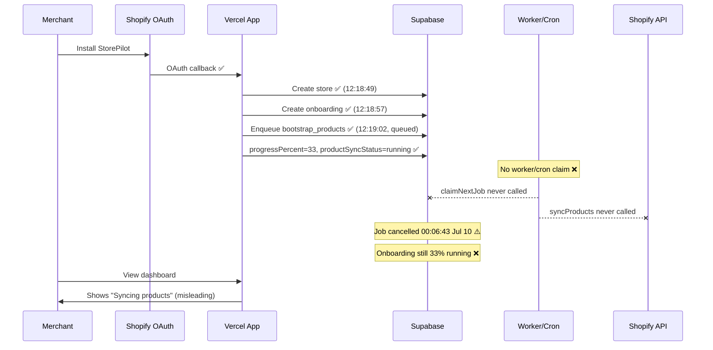

# Install E2E Trace — Phase C.1

**Date:** 2026-07-10  
**Fresh dev store install in Phase C.1:** **Not Verified** — not performed (requires merchant OAuth).

**Evidence sources:** Database query (2026-07-10T07:47Z), `docs/BOOTSTRAP_SYNC_AUDIT.md` (2026-07-09), runtime health endpoints.

---

## Store Under Trace

| Field | Value |
|-------|-------|
| Shop | `storepilot-pe9x0muw.myshopify.com` |
| Store ID | `7f1a9df7-d3db-45a1-9a59-a12155f371a1` |
| Install date | 2026-07-09 ~12:18 UTC |
| Products | **0** |
| Orders | **0** |
| Onboarding | **33% — "Syncing products"** |

---

## Sequence Diagram (Verified states)

---

## Timeline

| Time (UTC) | Event | Verified by |
|------------|-------|-------------|
| 2026-07-09 12:18:49 | Store created | Database |
| 2026-07-09 12:18:57 | Onboarding row created | Database |
| 2026-07-09 12:19:02 | bootstrap_products enqueued | Database / audit |
| 2026-07-09 12:19:03 | Onboarding startedAt set | Database |
| 2026-07-09 12:19–2026-07-10 00:06 | Job remains unclaimed (attempts=0) | Database |
| 2026-07-10 00:06:43 | Job status → **cancelled** | Database |
| 2026-07-10 00:25:13 | Onboarding updated (still 33%) | Database |
| 2026-07-10 01:00 (inferred) | Daily cron may have fired | **Not Verified** |
| 2026-07-10 07:40 | health/worker: 0 workers | Runtime endpoint |

---

## Pipeline Stages

| Stage | Status | Evidence |
|-------|--------|----------|
| OAuth | ✅ Complete | Store exists, active=true |
| Session | ✅ Assumed | Not directly queried |
| Bootstrap enqueue | ✅ | Job row exists |
| Products sync | ❌ | 0 products |
| Knowledge ingestion | ❌ | No sync completion |
| Knowledge graph | ❌ | Blocked |
| Learning | ⚠️ Partial | afterAuth sync bootstrap may have run — **not verified** |
| Executive COO | ❌ | Blocked |
| Dashboard ready | ❌ | Empty metrics |
| 100% complete | ❌ | progressPercent=33 |

---

## Latency Report

| Segment | Duration | Notes |
|---------|----------|-------|
| OAuth → enqueue | ~13 seconds | Verified timestamps |
| Enqueue → first worker claim | **∞ (never)** | attempts=0 |
| Total time to 100% | **Not achieved** | >19 hours and counting |

---

## Failure Report

**Primary failure:** No job executor (worker/cron) claimed `bootstrap_products`.

**Secondary failure:** Job cancelled without onboarding reconciliation — merchant left at 33% "Syncing products."

**Tertiary failure:** Dashboard displays `running` while job was queued/cancelled.

---

## Recovery & Retry

| Mechanism | Observed |
|-----------|----------|
| Job retry | ❌ attempts=0 |
| Onboarding retry UI | Not verified |
| Cron retry next day | **Not Verified** |
| Auto re-enqueue after cancel | ❌ None observed |

---

## Mandatory Fresh Install

**Status: Not Verified**

To complete Phase C.1 E2E requirement:
1. Create new Shopify dev store
2. Install app
3. Record full DB + worker trace
4. Confirm 100% without manual steps

**Blocked until worker infrastructure fixed.**
