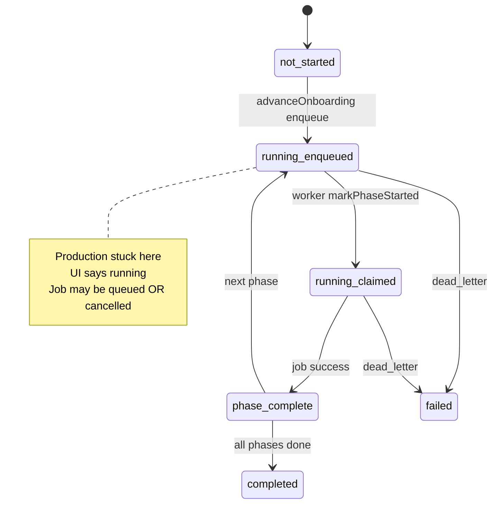

# Onboarding State Machine — Phase C.1

**Date:** 2026-07-10  
**Verification:** Code + database state

---

## Code Milestones (NOT 0/10/50/75)

| progressPercent | progressLabel | Phase status field | Job type |
|-----------------|---------------|-------------------|----------|
| 33 | Syncing products | productSyncStatus | bootstrap_products |
| 66 | Syncing inventory | inventorySyncStatus | bootstrap_inventory |
| 90 | Syncing orders | ordersSyncStatus | orders_historical |
| 100 | Onboarding complete | status=completed | — |

Source: `PHASE_CONFIG` in `app/services/onboarding.server.ts`

---

## Phase Status Enum

`not_started` → `running` → `completed` | `failed` | `blocked`

**Bug (verified):** `running` set at **enqueue**, not at worker **claim**.

---

## Production State (Verified via database)

```
store_onboarding.status = running
progressPercent = 33
progressLabel = "Syncing products"
productSyncStatus = running        ← UI shows "Syncing"
sync_jobs.status = cancelled       ← Job NOT running
sync_jobs.attempts = 0               ← Never claimed
```

**Dashboard lies:** Shows active sync while job is cancelled and worker inactive.

---

## Required vs Actual UI Behavior

| Condition | Required | Actual |
|-----------|----------|--------|
| job.status = queued | Must NOT show "Running" | ❌ Shows "Syncing products" (running) |
| worker inactive | "Waiting for processing" | ❌ Shows "Syncing products" |
| job.status = cancelled | Error/retry state | ❌ Still "Syncing products" |

---

## State Machine Diagram



---

## SyncStatusCard Inconsistency (Verified via code)

`SyncStatusCard.tsx` uses hardcoded `setupProgress` (18/58/100) from onboarding **status enum**, not:
- DB `progressPercent`
- Actual job queue state

---

## Issue D-1: Dashboard Misrepresents Queue State

| Severity | High |
| Location | onboarding.server.ts enqueue + dashboard loaders |
| Evidence | productSyncStatus=running + job=cancelled |
| Fix | Separate queued vs running; reconcile on cancel |
| Verification | UI matches sync_jobs.status |
