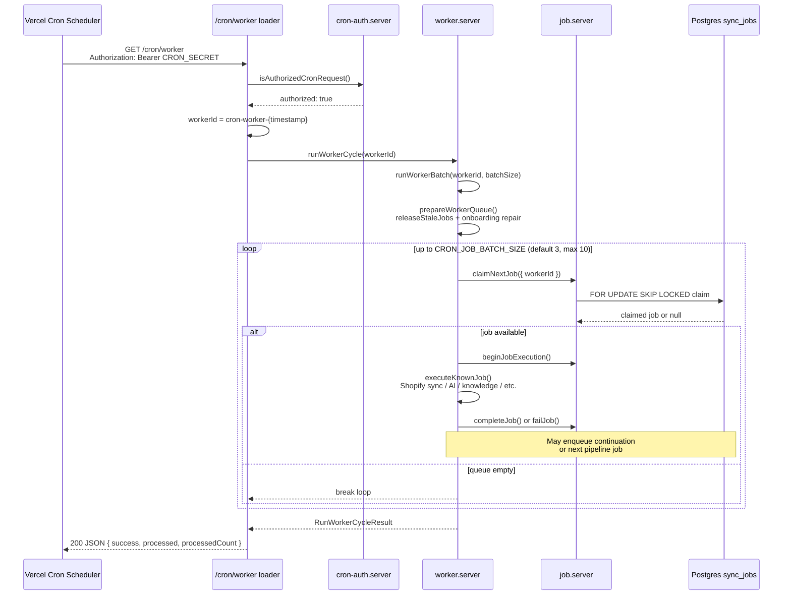

# RC4A.1 — Worker Architecture Certification

**Program:** RC4A.1 — Worker Architecture Verification  
**Date:** 2026-07-10  
**Scope:** Read-only codebase analysis — **no code modified**  
**Release artifact:** `baff5e5` (tag `v1.0.0-rc1`)

---

## Verdict

# **YES WITH CHANGES**

**Can StorePilot run entirely on Vercel without Railway?**

**Yes — for job execution.** The production job engine is already wired to Vercel Cron at `GET/POST /cron/worker`. Queued work in Postgres is claimed and executed inside ephemeral serverless invocations. No runtime code path *requires* `scripts/worker.ts`, `runContinuousWorker()`, Railway, or Docker.

**However**, several subsystems were written assuming a **persistent worker** (`worker_instances`, `activeWorkers > 0`). Under Vercel-only deployment those checks fail even when the queue is healthy. Deployment also needs `vercel.json` cron alignment and operational tuning (batch size, latency expectations).

Railway/Docker remain **optional performance enhancements**, not architectural prerequisites.

---

## 1. Primary architecture: A or B?

The codebase implements **both** modes. Official docs label continuous worker as primary and cron as fallback; **your intended Vercel-only model maps to mode B**.

| Mode | Mechanism | Entry point | Registers `worker_instances` |
|------|-----------|-------------|------------------------------|
| **A — Persistent worker** | Poll loop every 2s (default) | `npm run worker` → `scripts/worker.ts` → `runContinuousWorker()` | **Yes** |
| **B — Vercel Cron** | HTTP batch every 2 min | Vercel Cron → `/cron/worker` → `runWorkerCycle()` | **No** |

Both modes converge on the **same execution engine** in `app/services/worker.server.ts`.

Evidence — dual-path diagram in repo docs:

```10:47:docs/WORKER_ARCHITECTURE.md
StorePilot uses a **Postgres-backed job queue** (`sync_jobs`) with a **continuous worker process** as the primary execution path. Vercel Cron (`POST /cron/worker`) remains as a **fallback** for environments without a dedicated worker deployment.
...
    subgraph workers [Worker Layer]
        CW[Continuous Worker<br/>npm run worker]
        CRON[Vercel Cron Fallback<br/>/cron/worker]
    end
...
    CW --> PREP
    CRON --> PREP
```

Evidence — continuous worker is **not imported by the Vercel app**; only the standalone script uses it:

```1:10:scripts/worker.ts
import { runContinuousWorker } from "../app/services/worker-runtime.server";

runContinuousWorker().catch((error) => {
  ...
});
```

Grep of `app/` shows `runContinuousWorker` appears only in `worker-runtime.server.ts` and tests — never in routes or Shopify bootstrap.

**Answer:** For Vercel-only hosting, the design is **B — Vercel Cron invoking `/cron/worker` every few minutes**, backed by additional daily dispatch crons for maintenance and intelligence scheduling.

---

## 2. Codebase search — who does what?

### Who processes queued jobs?

| Processor | How | File |
|-----------|-----|------|
| **Vercel Cron (intended production path)** | Authorized HTTP request runs one batch cycle | `app/routes/cron.worker.tsx` |
| **Continuous worker (optional)** | Infinite poll loop runs repeated batches | `app/services/worker-runtime.server.ts` |

Both call `runWorkerBatch()` → `executeNextClaimedJob()` in `worker.server.ts`.

### What claims jobs?

`claimNextJob()` in `app/services/job.server.ts` — Postgres `FOR UPDATE SKIP LOCKED` on `sync_jobs`, sets `lockedBy`, `lockExpiresAt`, increments `workerGeneration`.

```530:568:app/services/job.server.ts
export async function claimNextJob(
  input: ClaimNextJobInput,
): Promise<JobClaimResult | null> {
  ...
    WITH next_job AS (
      SELECT id FROM sync_jobs
      WHERE status IN ('queued'::"JobStatus", 'retrying'::"JobStatus")
        AND "availableAt" <= NOW()
      ORDER BY ... priority ..., "createdAt" ASC
      FOR UPDATE SKIP LOCKED
      LIMIT 1
    )
    UPDATE sync_jobs AS jobs
    SET status = 'claimed'::"JobStatus", "lockedBy" = ${input.workerId}, ...
```

### What invokes `executeNextClaimedJob()`?

Only `runWorkerBatch()` — loop up to `batchSize` times:

```993:1013:app/services/worker.server.ts
export async function runWorkerBatch(
  workerId: string,
  batchSize = resolveWorkerBatchSize(),
): Promise<RunWorkerCycleResult> {
  ...
  for (let index = 0; index < batchSize; index += 1) {
    const processed = await executeNextClaimedJob(workerId);
    if (!processed) {
      break;
    }
    processedJobs.push(processed);
  }
```

Call chain:

```
/cron/worker  →  runWorkerCycle()  →  runWorkerBatch()  →  executeNextClaimedJob()
npm run worker  →  runContinuousWorker()  →  runWorkerBatch()  →  executeNextClaimedJob()
```

### What invokes `worker.server.ts`?

| Caller | Function |
|--------|----------|
| `app/routes/cron.worker.tsx` | `runWorkerCycle(workerId)` |
| `app/services/worker-runtime.server.ts` | `runWorkerBatch(workerId, batchSize)` |
| Tests | Direct imports |

Job **producers** (enqueue only, do not execute): `afterAuth` in `shopify.server.ts`, webhooks, onboarding phase advancement, intelligence schedulers, and `cron/dispatch/*` maintenance routes.

### Is `/cron/worker` sufficient?

**Functionally: yes** — it is the complete worker engine for queued `sync_jobs`.

**Operationally: with caveats:**

| Caveat | Detail |
|--------|--------|
| Batch throughput | Default `CRON_JOB_BATCH_SIZE=3`, max 10, every 2 minutes |
| Multi-chunk jobs | Knowledge ingest, graph build re-enqueue continuation jobs; need subsequent cron ticks |
| Latency | Docs state cron alone is "not sufficient alone for low-latency onboarding" (`docs/WORKER_ARCHITECTURE.md` line 86) — UX concern, not a hard failure |
| Function timeout | Long Shopify syncs run inside one invocation; must fit Vercel max duration |
| Stale lock recovery | `prepareWorkerQueue()` calls `releaseStaleJobs()` at start of every cycle — covered without persistent worker |

### Does any code require a continuously running process?

**No production requirement found.**

| Component | Continuous? | Notes |
|-----------|-------------|-------|
| `runContinuousWorker()` | Yes | Only via `scripts/worker.ts` — optional deployment |
| `withJobHeartbeat()` in `worker.server.ts` | Per-job `setInterval` | Runs inside a single serverless invocation while a job executes |
| `afterAuth` bootstrap | Synchronous HTTP | Runs inline during OAuth callback on Vercel |
| Learning bootstrap at auth | Synchronous HTTP | `bootstrapIntelligenceAfterAuth()` in `shopify.server.ts` — not queued |
| App startup | No worker spawn | No import of `runContinuousWorker` in `app/` |

The only always-on loop is in `worker-runtime.server.ts` (`while (!shutdownRequested)`), which is **never started** unless `npm run worker` is deployed separately.

---

## 3. Pipeline jobs — who starts, continues, finishes?

All **queued** intelligence/sync jobs follow the same pattern:

1. **Start** — some producer enqueues a row in `sync_jobs`
2. **Continue** — worker batch claims and runs; if `hasMoreWork`, scheduler re-enqueues a continuation job
3. **Finish** — `completeJob()` / onboarding finalizers mark terminal state; downstream jobs may be enqueued

### `bootstrap_products` (onboarding phase 1)

| Stage | Actor | Code |
|-------|-------|------|
| **Start** | Shopify `afterAuth` → `advanceOnboarding()` enqueues `JobType.bootstrap_products` | `app/shopify.server.ts`, `app/services/onboarding.server.ts` |
| **Continue** | `/cron/worker` claims job, `syncProductsFromShopify()` | `worker.server.ts` case `bootstrap_products` |
| **Finish** | `finalizeSuccessfulJobPhase()` completes job + atomically enqueues next phase | `onboarding.server.ts` → `executeAdvanceOnboarding()` |

Side effect on product sync success: fire-and-forget `scheduleKnowledgeIngestJob()` for initial knowledge import.

### Product sync (ongoing)

| Stage | Actor |
|-------|-------|
| **Start** | Onboarding bootstrap; also webhook-driven updates enqueue connector/product jobs |
| **Continue/Finish** | Same worker engine via `executeKnownJob` |

### Knowledge graph pipeline

Chain enforced inside `executeKnownJob`:

```
bootstrap_products success
  → scheduleKnowledgeIngestJob (async void)
    → worker runs knowledge_ingest
      → if hasMoreWork: re-enqueue knowledge_ingest (continuation)
      → else: scheduleGraphBuildJob
        → worker runs knowledge_graph_build
          → if hasMoreWork: re-enqueue graph job
          → else: scheduleHistoricalIntelligenceJob
```

Evidence:

```594:803:app/services/worker.server.ts
void scheduleKnowledgeIngestJob({ ... syncMode: "initial_import" ... });
...
if (result.hasMoreWork) {
  await scheduleKnowledgeIngestJob({ idempotencyKey: `knowledge:continue:...` });
} else {
  void scheduleGraphBuildJob({ idempotencyKey: `graph:after-ingest:...` });
}
...
if (graphResult.hasMoreWork) {
  await scheduleGraphBuildJob({ idempotencyKey: `graph:continue:...` });
} else if (job.jobType === JobType.knowledge_graph_build) {
  void scheduleHistoricalIntelligenceJob({ ... });
}
```

Daily **maintenance** knowledge refresh (separate from onboarding chain): Vercel cron `/cron/dispatch/knowledge-refresh` enqueues `connector_sync` jobs per store (`cron-jobs.server.ts`).

### Learning

| Path | Mechanism |
|------|-----------|
| **Inline at install** | `bootstrapIntelligenceAfterAuth()` runs synchronously in `afterAuth` (not queued) |
| **Queued bootstrap** | `JobType.learning_bootstrap` executed by worker if enqueued (`scheduleLearningBootstrapJob` exists but primary auth path is inline) |
| **Daily profile updates** | Vercel cron `/cron/dispatch/learning-engine` → `runLearningEngineCron()` updates learning profiles directly (no `sync_jobs` queue) |

### Prediction

| Stage | Actor |
|-------|-------|
| **Start** | Enqueued via `schedulePredictionGenerateJob()` from intelligence pipeline chain |
| **Execute** | Worker case `prediction_generate` → `executePredictionGenerateJob()` |
| **Continue** | On success, chains `experiment_generate` via `scheduleIntelligencePipelineJob()` |

### Executive jobs

| Job type | Start | Execute |
|----------|-------|---------|
| `executive_brief_generate` | Daily cron `/cron/dispatch/daily-operating-plan` enqueues per store | Worker case `executive_brief_generate` |
| `executive_decision_generate` | Chained after `quick_wins_generate` | Worker case → chains `root_cause_generate` |
| `executive_coo_generate` | Pipeline scheduler | Worker case → chains `merchant_intelligence_refresh` |

Full intelligence chain after graph build (all via queue + cron worker batches):

```
historical_intelligence → quick_wins_generate → executive_decision_generate
  → (pipeline) root_cause → prediction → experiment → ...
```

Evidence in `worker.server.ts` cases `historical_intelligence` through `executive_coo_generate`.

### Onboarding phase chain (summary)

```
afterAuth
  → advanceOnboarding()           [enqueue bootstrap_products]
  → /cron/worker                  [sync products → finalize → enqueue inventory]
  → /cron/worker                  [sync inventory → finalize → enqueue orders]
  → /cron/worker                  [sync orders → finalize → COMPLETE]
  → scheduleOrdersIncrementalSync [post-complete scheduler, not onboarding queue]
```

Each phase completion calls `finalizeSuccessfulJobPhase()` which atomically completes the job and calls `executeAdvanceOnboarding()` to enqueue the next phase job.

---

## 4. Proof — Vercel Cron execution flow

When `CRON_SECRET` is configured and Vercel fires the schedule, this is the exact path:



Cron route source:

```84:114:app/routes/cron.worker.tsx
export const loader = async ({ request }: LoaderFunctionArgs) => {
  ...
  const authorization = isAuthorizedCronRequest(request);
  if (authorization.authorized) {
    const workerId = `cron-worker-${Date.now()}`;
    ...
    const result = await runWorkerCycle(workerId);
    return Response.json({
      success: true,
      workerId: result.workerId,
      processed: result.processed,
      health: getCronWorkerHealth(),
    });
```

Batch size resolution (shared env var name used for cron):

```122:128:app/services/worker.server.ts
function resolveWorkerBatchSize(): number {
  const raw = Number(process.env.CRON_JOB_BATCH_SIZE ?? 3);
  ...
  return Math.min(10, Math.floor(raw));
}
```

**Conclusion:** No Railway process participates. Jobs move from `queued` → `claimed` → `running` → `completed` entirely within Vercel serverless invocations triggered by cron.

---

## 5. When would a persistent worker actually be required?

**No code dependency makes Railway mandatory.** The following are **operational preferences**, not hard blockers:

| Concern | Persistent worker advantage | Cron-only mitigation |
|---------|----------------------------|----------------------|
| Onboarding latency | Poll every 2s, batch 3+ | Accept 2-min tick latency; raise `CRON_JOB_BATCH_SIZE` to 10 |
| Queue drain rate | Continuous processing | More frequent cron (Vercel plan limits apply) |
| `worker_instances` heartbeats | Registers active worker | Not used by cron path today |
| Orphan semantics | Worker ID in registry | `releaseStaleJobs()` on every cycle + lock expiry (300s default) |

**Dependencies that do NOT require persistent worker:**

- Job claiming (`claimNextJob`) — stateless, Postgres-backed ✅
- Job heartbeats during execution (`withJobHeartbeat`) — in-process timer ✅
- Stale lock release (`prepareWorkerQueue` → `releaseStaleJobs`) — runs at cron cycle start ✅
- Multi-step pipelines — self-continuing via re-enqueue ✅
- Shopify OAuth bootstrap — runs in `afterAuth` HTTP handler ✅

**Railway/Docker artifacts exist but are optional:**

- `Dockerfile.worker`, `railway.toml` — deployment convenience
- `docs/WORKER_ARCHITECTURE.md` — documents continuous worker as "recommended" not "required"

---

## 6. `vercel.json` cron schedule verification

### Configured in `vercel.json`

```5:10:vercel.json
  "crons": [
    { "path": "/cron/worker", "schedule": "*/2 * * * *" },
    { "path": "/cron/dispatch/cleanup-jobs", "schedule": "0 2 * * *" },
    { "path": "/cron/dispatch/knowledge-refresh", "schedule": "0 3 * * *" },
    { "path": "/cron/dispatch/learning-engine", "schedule": "0 4 * * *" },
    { "path": "/cron/dispatch/daily-operating-plan", "schedule": "0 6 * * *" }
  ],
```

### Canonical schedule registry (`cron-scheduler.server.ts`)

| Job ID | Schedule | Path | In `vercel.json`? |
|--------|----------|------|-------------------|
| **worker** | `*/2 * * * *` | `/cron/worker` | ✅ |
| cleanup-jobs | `0 2 * * *` | `/cron/dispatch/cleanup-jobs` | ✅ |
| knowledge-refresh | `0 3 * * *` | `/cron/dispatch/knowledge-refresh` | ✅ |
| learning-engine | `0 4 * * *` | `/cron/dispatch/learning-engine` | ✅ |
| daily-operating-plan | `0 6 * * *` | `/cron/dispatch/daily-operating-plan` | ✅ |
| retry-queue | `*/5 * * * *` | `/cron/dispatch/retry-queue` | ❌ **Missing** |
| expired-sessions | `0 * * * *` | `/cron/dispatch/expired-sessions` | ❌ Missing |
| metrics-aggregation | `0 */6 * * *` | `/cron/dispatch/metrics-aggregation` | ❌ Missing |
| recommendation-refresh | `0 7,19 * * *` | `/cron/dispatch/recommendation-refresh` | ❌ Missing |
| privacy-pii-scan | `0 1 * * *` | `/cron/dispatch/privacy-pii-scan` | ❌ Missing |
| scope-drift-monitor | `0 8 * * *` | `/cron/dispatch/scope-drift-monitor` | ❌ Missing |
| token-migration | `0 5 * * *` | `/cron/dispatch/token-migration` | ❌ Missing |

**Worker cron alignment:** ✅ `/cron/worker` at `*/2 * * * *` matches `WORKER_CRON_SCHEDULE` in `cron-scheduler.server.ts` (line 170–177).

**Gap:** Six maintenance crons defined in code are **not** registered in `vercel.json`. For Vercel-only deployment:

- **retry-queue** is partially redundant because `prepareWorkerQueue()` already calls `releaseStaleJobs()` every 2 minutes via `/cron/worker`
- **expired-sessions**, **metrics-aggregation**, **recommendation-refresh**, **privacy-pii-scan**, **scope-drift-monitor**, **token-migration** will **never run** until added to `vercel.json` or invoked manually

**Recommendation (documentation only):** Add missing dispatch crons to `vercel.json` before certifying full Vercel-only ops parity.

---

## 7. `/health/worker` and `activeWorkers > 0`

### Current behavior — incompatible with Vercel-only cron

```43:45:app/services/worker-health.server.ts
  if (input.workers.activeWorkers === 0) {
    alerts.push("no_active_workers");
  }
```

```79:82:app/services/worker-health.server.ts
  if (alerts.some((alert) => alert.startsWith("no_active_workers"))) {
    return "unhealthy";
  }
```

```11:13:app/routes/health.worker.tsx
export const loader = async () => {
  const health = await getWorkerInfrastructureHealth();
  return Response.json(health, { status: health.ok ? 200 : 503 });
};
```

**Root cause:** `activeWorkers` counts rows in `worker_instances` with recent heartbeat. Only `runContinuousWorker()` calls `registerWorkerInstance()`:

```190:191:app/services/worker-runtime.server.ts
  await registerWorkerInstance({ workerId });
  startWorkerHeartbeatLoop(workerId, heartbeatIntervalMs);
```

Cron workers use ephemeral IDs (`cron-worker-${Date.now()}`) and **never register**. Therefore **`/health/worker` will return 503 on any Vercel-only deployment** even when jobs are processing normally.

This explains prior audit findings:

- `/health/worker` → 503
- `activeWorkers: 0`
- `worker_instances: 0`
- Alert: `no_active_workers`

These are **health-check design mismatches**, not evidence that the worker engine is broken.

### Secondary issue — false orphan detection during cron execution

```893:896:app/services/job.server.ts
    const workerOffline =
      input?.activeWorkerIds !== undefined &&
      job.lockedBy !== null &&
      !input.activeWorkerIds.has(job.lockedBy);
```

While a cron invocation holds a lock, `lockedBy` is `cron-worker-*` which is **not** in `worker_instances`. Health checks during active cron execution can report `orphan_jobs` with reason `worker_offline` → **degraded** status (not unhealthy unless combined with other alerts).

### Recommended `/health/worker` behavior under serverless cron

**Do not treat `activeWorkers === 0` as unhealthy when cron queue processing is the intended architecture.**

Suggested logic (for future implementation — not applied in this audit):

1. **Primary signal:** `cronFallback.queueEnabled === true` (`CRON_SECRET` configured) **AND** queue metrics acceptable (`queued`, `oldestQueuedJobAgeMs`, `deadLetter`).
2. **Remove or downgrade** `no_active_workers` to informational when `WORKER_MODE=cron` env var is set (or when no persistent worker is expected).
3. **Healthy example criteria:**
   - `CRON_SECRET` present
   - `deadLetter === 0` (or below threshold)
   - `oldestQueuedJobAgeMs < 10 minutes` (already partially checked)
   - No `orphan_jobs` with `reason: lock_expired` (stuck jobs)
4. **Orphan detection fix:** When in cron-only mode, either:
   - Skip `worker_offline` orphan classification for `lockedBy` matching `/^cron-worker-/`, **or**
   - Have cron route call `registerWorkerInstance` at cycle start and `markWorkerStopped` at cycle end
5. **Return 200 with `status: "degraded"`** for elevated queue depth rather than 503 for missing persistent workers.

`/health/monitor` inherits the same failure via `checkWorkerHealth()` → `getWorkerInfrastructureHealth()` in `monitoring.server.ts`.

---

## 8. Should `worker_instances` exist on fully serverless StorePilot?

| Question | Answer |
|----------|--------|
| **Required for job processing?** | **No** — claims use `sync_jobs.lockedBy` string, not FK to `worker_instances` |
| **Used by cron path?** | **No** — cron never registers |
| **Used by health checks?** | **Yes — incorrectly as sole liveness signal** |
| **Used by orphan recovery in continuous mode?** | Yes — `getActiveWorkerIds()` in `worker-runtime.server.ts` |

**Recommendation:**

- **Short term (Vercel-only):** Table can remain (migration already applied); ignore `activeWorkers` for go/no-go decisions until health logic is updated.
- **Long term options:**
  1. **Deprecate as liveness source** — treat as optional telemetry for Railway deployments only
  2. **Repurpose for cron** — register ephemeral cron cycles (short TTL) so ops has visibility
  3. **Remove from health aggregation** entirely in cron-only environments

The table is **not harmful** to serverless operation; the **health interpretation** is harmful.

---

## 9. Required changes before Vercel-only certification

| # | Change | Severity | Type |
|---|--------|----------|------|
| 1 | Fix `/health/worker` — stop 503 on `activeWorkers === 0` when cron is primary | **Blocker** for health gates | Code |
| 2 | Fix orphan detection for `cron-worker-*` lock holders | Medium | Code |
| 3 | Add missing dispatch crons to `vercel.json` | Medium | Config |
| 4 | Set `CRON_SECRET` in Vercel production | **Blocker** | Env |
| 5 | Tune `CRON_JOB_BATCH_SIZE` (up to 10) for onboarding throughput | Low | Env |
| 6 | Update deployment docs to de-emphasize Railway as required | Low | Docs |
| 7 | Accept 2-minute max worker tick latency for onboarding UX | Informational | Ops |

Items 1–2 explain why verdict is **YES WITH CHANGES** rather than plain **YES**.

---

## 10. Evidence summary table

| Question | Finding | Verdict |
|----------|---------|---------|
| Architecture mode for Vercel | Cron `/cron/worker` every 2 min | B |
| Job processor | `runWorkerBatch` in `worker.server.ts` | Cron + optional continuous |
| Job claimer | `claimNextJob` in `job.server.ts` | Postgres SKIP LOCKED |
| `executeNextClaimedJob` caller | `runWorkerBatch` loop | Both paths |
| Persistent process required? | No | Cron sufficient for execution |
| `/cron/worker` in `vercel.json`? | Yes, `*/2 * * * *` | Aligned |
| `/health/worker` valid on Vercel-only? | No — always 503 today | **Needs change** |
| `worker_instances` needed? | No for processing; yes for current health | **Repurpose or ignore** |
| Railway required? | No | Optional |

---

## 11. Correction to prior RC4A assumptions

Prior RC4A dry-run reports listed **Railway not linked** and **Docker build not proven** as critical blockers for worker deployment. This audit supersedes that framing:

- Railway/Docker prove the **optional continuous worker** path
- They are **not blockers** for Vercel-only architecture
- The real blockers for Vercel-only are **`CRON_SECRET`**, **health-check compatibility**, and **complete cron registration**

---

## 12. Sign-off

| Check | Result |
|-------|--------|
| Code modified | ⛔ None |
| Architecture determined | ✅ Dual-mode; Vercel cron is viable primary |
| Execution flow documented | ✅ |
| Health mismatch identified | ✅ Root cause of prior 503 |
| `vercel.json` verified | ✅ Worker cron OK; 6 dispatch crons missing |

**Final answer:** StorePilot **can** run entirely on Vercel without Railway, **with changes** to worker health semantics and optional cron schedule completeness.
